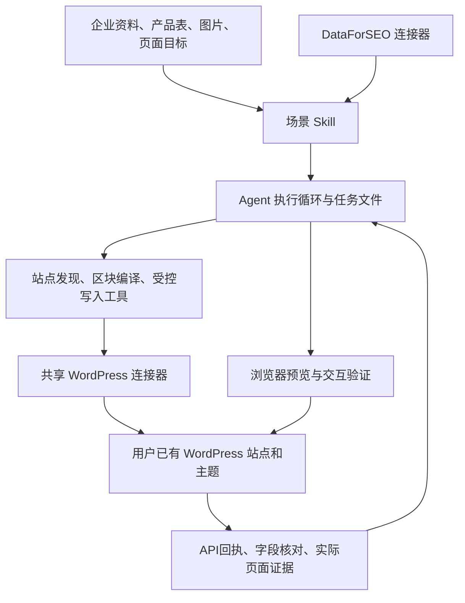

# 架构、场景与当前状态

> 历史资料：本文件保留当时方案与验收，不是当前执行规范。当前仅支持新站，入口见 [系统架构](ARCHITECTURE.md) 与 [新站总编排](../.agents/skills/wordpress-builder/SKILL.md)。

依据 2026-09-08 源工作区快照；实现与测试结论分别标注，不代表已部署到用户日常扩展。

## 1. 分层职责

| 层 | 职责 | 原项目参考 |
| --- | --- | --- |
| Skill | 场景流程、资料依据、工具选择、验收标准 | `skills/wordpress/` |
| Agent 宿主 | 模型调用、审批、任务文件、上下文、暂停和恢复 | `source-snapshot/src/agent/runtime.ts` 等；不是可独立运行的完整宿主 |
| WordPress 工具 | 检测、原生块序列化、写入、字段校验、回执 | `source-snapshot/src/agent/connections/wordpress-*.ts` |
| 连接器 | 固定站点 HTTPS、用户名、Application Password、请求边界 | `source-snapshot/src/agent/connections/wordpress.ts` |
| WordPress 站点 | 当前主题、核心 REST、CPT/ACF、可用插件能力 | 可选 `wordpress-site/plugin/octopus-site`；普通页面无需此插件 |
| 浏览器能力 | 页面观察、输入、预览、截图和链接检查 | 由未来宿主接入；复制的资料不是完整浏览器执行器 |

凭据由连接器设置保存，Skill 中不保存凭据。原项目正式主线为 Vercel AI SDK ToolLoopAgent；其他 Pi 候选研究不能视为已替换 WordPress 产品宿主，新项目可独立评估后再选择。

## 2. 场景与覆盖情况

| 场景 | 已有实现或研究 | 验证与限制 |
| --- | --- | --- |
| 已有站点检测 | 主题、区块、模板、权限、内容类型和字段适配报告 | 有真实站点检测证据；unknown、缺权限与未适配必须分开 |
| 原生页面生成 | 首页、产品、关于、联系、FAQ、广告落地页共用受控块 | 四页草稿与桌面/390px截图有阶段验收；任意页面设计不在已覆盖范围 |
| 页面样式 | section、columns、颜色、间距、圆角及真实模板选择 | 有界嵌套和受支持属性；不等于完整 theme.json/Global Styles 编辑 |
| 产品 CMS | 可选 oct_product/oct_case、meta、原生表单/ACF 共用字段 | 字段与前台模板绑定需分别验证；不强制安装自有数据插件 |
| 批量产品导入 | Excel/CSV资料、字段映射、预览、分批草稿 | 单批最多20条，稳定键查重；不是任意 WooCommerce 商品全功能导入 |
| 图文资料 | 图片/PDF原件、alt、caption、特色图、正文媒体ID | 单媒体10MB等原实现限制需移植核对；真实业务素材全流程未完成验收 |
| 询盘表单 | WPForms 固定 Abilities 读取/创建/字段与安全设置 | 依赖实际版本、授权和写开关；通知/第三方集成及邮件送达未验收 |
| SEO文章 | DataForSEO → 搜索意图/资料 → 文章 → WordPress草稿/发布 | 相关Skill与工具已有；事实审核和真实业务发布需独立验收 |
| SEO设置 | Rank Math 固定能力适配、写后读取 | 仅实际公开 schema 支持的字段；不能当任意版本通用API |
| 首页与站点标题 | `wpReadSite/wpConfigureSite source=native` | 有真实原生设置阶段验证；选定首页必须已发布 |
| 简单导航 | 计划、固定版本、局部精确替换、回读 | 有独立真实导航验证；复杂菜单、全站任意页眉页脚设计未支持 |
| SEO监测 | 有限次数的DataForSEO快照、查询、暂停 | 浏览器关闭时不运行，不是完整服务器监测服务 |
| 主题创建/安装/切换 | 历史实验资料保留 | 已撤回捆绑主题路线，不作为当前产品入口 |
| 完整自主建站 | 真实模型已执行多个测试任务 | **未通过；发布、首页和导航的端到端自主链路尚未完成** |

## 3. 工具接口地图

| 类型 | 工具 |
| --- | --- |
| 发现和读取 | `wpRead`、`wpReadDesignProfile`、`wpReadSite`、`wpReadAbility` |
| 页面和媒体 | `wpCompilePage`、`wpWriteContent`、`wpUploadMedia` |
| 产品导入 | `wpPreviewProducts`、`wpImportProducts` |
| 站点和导航 | `wpConfigureSite`、`wpPlanNavigation`、`wpApplyNavigation` |
| 插件写能力 | `wpWriteAbility` |
| 恢复与回执 | `wpWorkflowStatus` |

`wpRead content` 的新实现返回实际ID、URL、状态、modifiedGmt和最多6000字符正文；`rawComplete` 为false时不能把片段当完整内容，其他字段仍在完整证据文件。

普通 page 写入使用受控 blocks，更新带实际 ID 与 expectedModified，默认草稿。站点设置的 native/companion 两种来源和 revision 不混用。外部写操作走原产品审批，API 请求目的地绑定当前连接配置。

原实现有一些需要新项目单独研究的兼容范围：子目录安装和 REST 根路径发现、不同托管平台认证、定制 post type REST namespace、实际插件版本与付费能力。不要把待研究项静默扩展成支持承诺。

## 4. 证据分层

1. 原生区块解析/序列化测试：证明格式或受控逻辑，不证明页面设计质量。
2. 工作流与审批测试：证明冲突、重复写、拒绝后零请求等逻辑。
3. Playground API 和浏览器测试：证明特定版本/主题上的阶段能力。
4. 真实 HTTPS 连接器测试：证明生产连接器路径能通过真实应用密码写草稿与回读。
5. 真实模型自主任务：证明模型选择和调用工具后的业务结果，本层尚未通过完整建站验收。

最后一次修复的历史回归为 typecheck、lint、53项相关测试及独立构建通过。本次资料同步仅校验文件与Skill完整性，没有重新执行这些产品测试，也没有刷新外部厂商文档。

证据入口：[四页草稿](../source-snapshot/docs/research/browser-wordpress-site-20260908/four-pages/README.md)、[简单导航](../source-snapshot/docs/research/browser-wordpress-site-20260908/navigation/README.md)、[真实模型验收](../source-snapshot/docs/research/browser-wordpress-site-20260908/e2e/README.md)。
