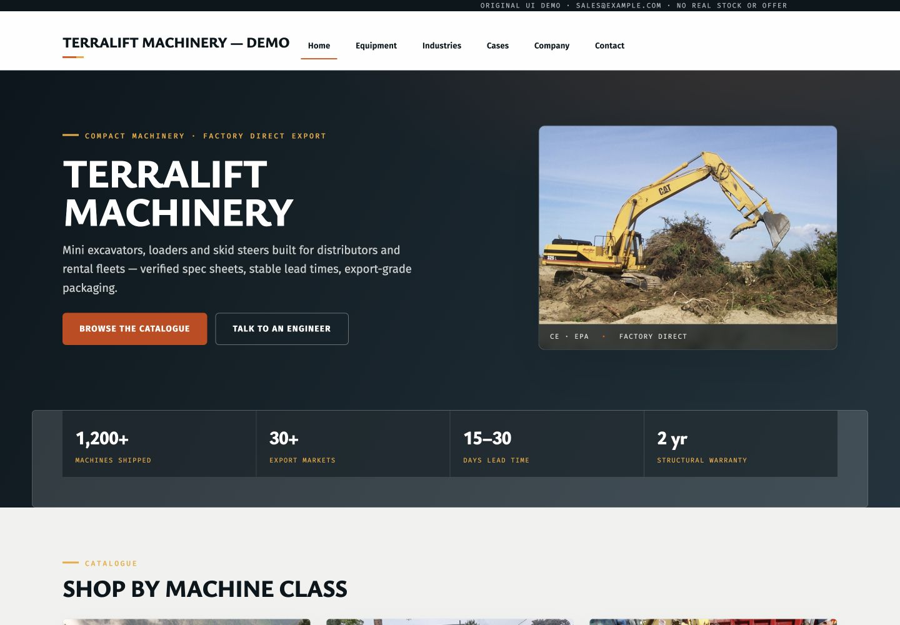
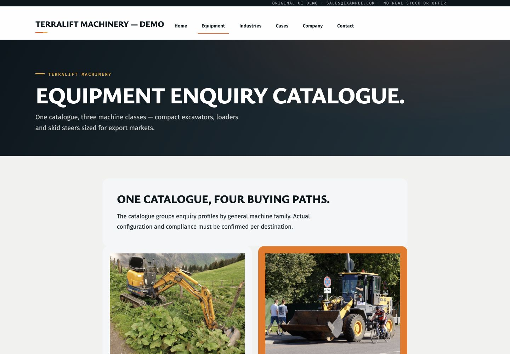
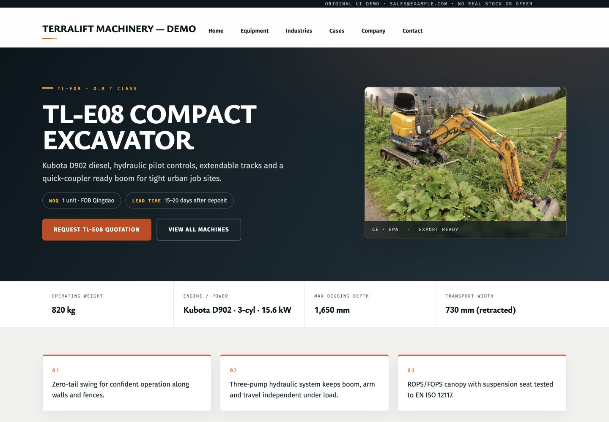
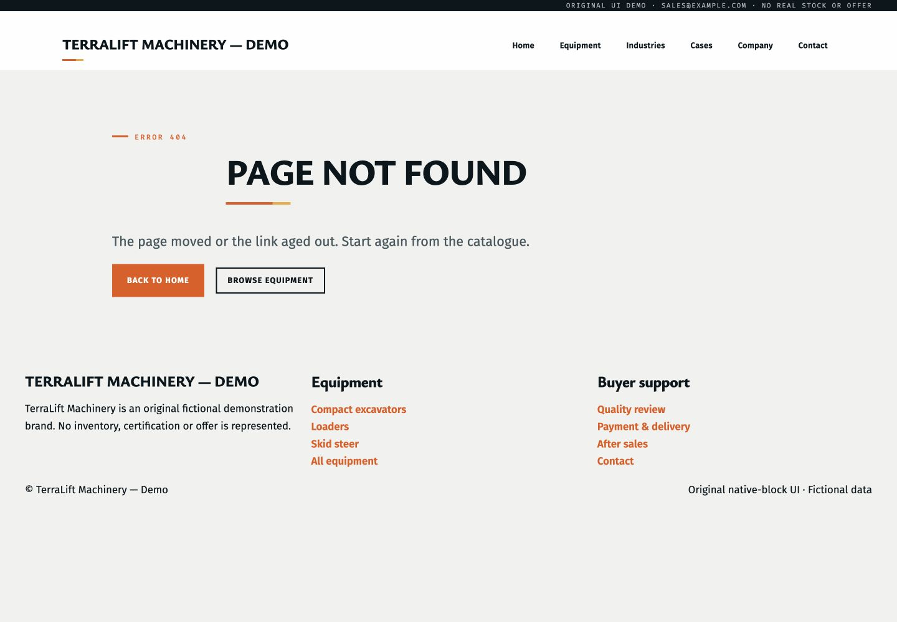
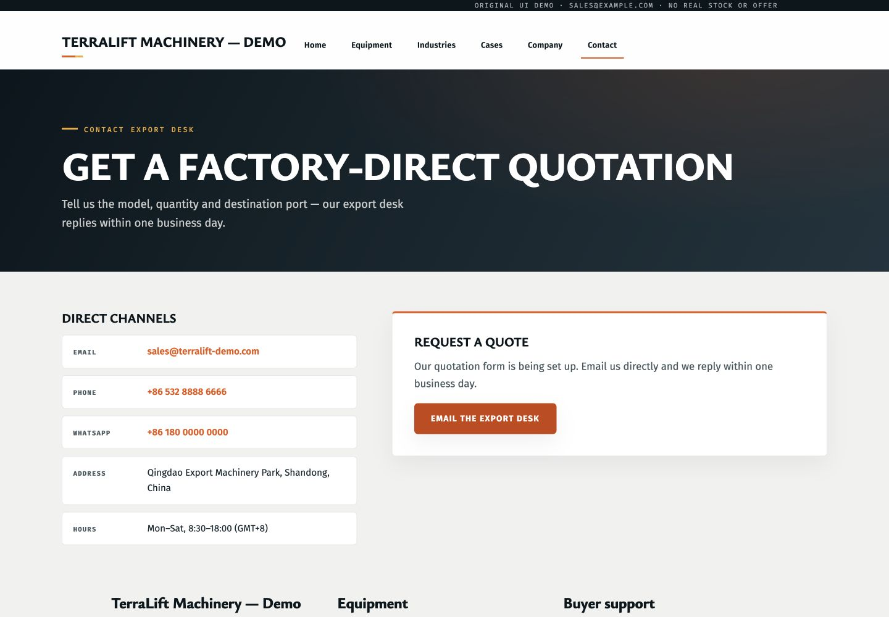
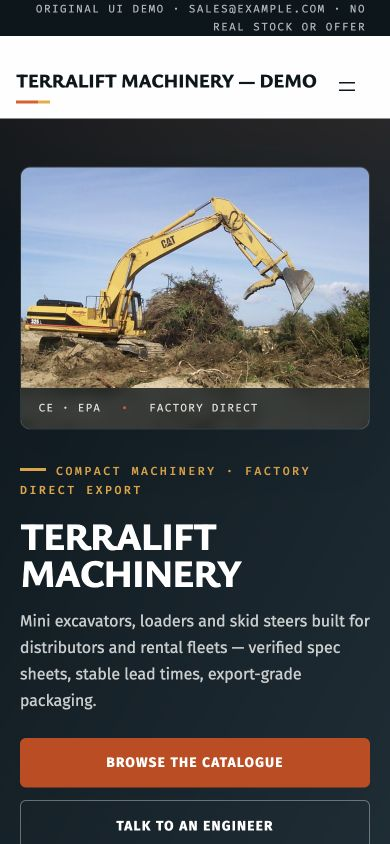
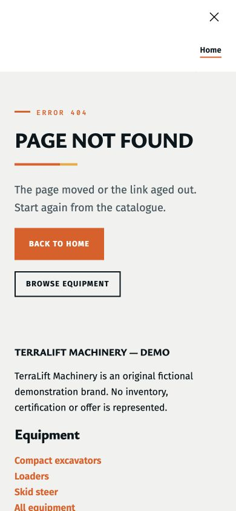
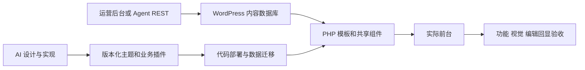

# WordPress AI 建站系统审计与重构决策

- 时间：2026-09-19 21:55:00 Asia/Shanghai（UTC+08:00）。
- 触发：用户切换至 OpenAI 后要求重新判断架构是否正确、是否属于当前最佳路线，并系统审计质量不佳的演示站。
- 审计基线：`main` / `a49821fa88311b5fa59f4d0298b8a6f5b71bd7a1`；开始时工作区干净。
- 初审产出（修复前）：重新运行测试、恢复本地服务、浏览器实测采购路径、官方资料核验、源码审查及改造决策。没有修改主题、Skill 执行规则、站点内容或生产环境；以下修复方案尚未实施。
- 当前修复状态见第 10 节；前面的截图、故障和未实施描述保留为初审历史。
- 本报告更正旧报告的过度结论；保留旧记录作为历史证据。
- 架构复核：恢复用户原始需求后，修正本报告初稿“区块主题作为默认”的建议。用户要求 AI 管理自由布局、ACF 编辑内容，不等于要求运营人员用 Site Editor 编辑全部布局。以下第 3、6、8 节为本轮修订结论；实现尚未迁移。

## 1. 判决

**WordPress + CPT/ACF + 原生主题能力 + 可恢复的 Agent 工具链，是适合外贸 B2B 目录与询盘站的合理底座；当前实现不能称为“最佳方案”，也未达到可以展示为成熟产品的完成度。**

应保留数据与执行底座，重新设计渲染边界、模板所有权、设计验收和实际采购路径。没有理由因为当前站点不好看就迁往 Headless 或更换 CMS；也没有证据支持“全部切 PHP 自由模板就能提高设计质量”。

最关键的问题是：**原生区块主题的运行机制、经典 PHP 页面的渲染方式、ACF 字段后台和 REST 自动化混在一起，却没有相应的集成测试和能力边界。** 手机菜单故障正是这一点的可复现结果。

“原生”需明确：CPT、区块、模板层级、REST 属于 WordPress 平台能力；ACF/Fluent Forms 属于第三方插件。PHP 自由模板可正常使用 WordPress，但其自由 HTML 区域不会自动变成 Gutenberg 可视化编辑区域。字段可编辑不等于版式可编辑。

## 2. 审计方法与实际环境

1. 读取当前 Skill、theme-code/design/runtime、主题 PHP/CSS/导航配置、工具日志机制、模板工具和部署脚本。
2. 阅读 WordPress 官方模板加载器、脚本模块机制及动态区块文档；核验 ACF REST 格式。
3. 恢复既有 Playground，使用 Codex 内置浏览器，以 1440×1000 和 390×844 检查关键路径。
4. 通过认证 GET 获取页面、产品、插件和模板状态；未执行内容写入。额外检查 32 个 URL 的 HTTP、标题、H1、导航模块和 import map。
5. 比较主题真源各文件与运行目录对应文件的 SHA-256：**本轮未发现对应文件内容漂移**。该比对未用于证明运行目录没有额外文件。

实际运行环境自行报告 WordPress **7.1**、主题 `terralift-ui`、ACF **6.8.9**。虽然启动命令指定 `--wp=6.9`，挂载目录的 `wp-includes/version.php` 和本轮生成的 environment.json 均为 7.1。不得再把启动参数当作 WordPress 6.9 实测证明；没有校验核心发行包来源/完整性，7.1 在这里是运行环境报告值，不是对官方稳定版本的认证。

工具链 `typecheck`、`lint`、**23/23 测试通过**。这些主要验证 TypeScript REST/计划/日志行为；不会证明 PHP 生命周期、手机交互、美观、邮件送达或完整 SEO 正确。

原始结果：[runtime-audit.json](acceptance/0919-system-audit/runtime-audit.json)、[浏览器报错](acceptance/0919-system-audit/browser-errors.json)、[手机溢出定位](acceptance/0919-system-audit/mobile-overflow.json)。

## 3. 当前路线与可选路线

这不是对竞品进行同题生成的实测排名。竞品部分属于截至本轮查询的第一方能力说明；工程取舍属于本次判断。

| 路线 | 适合的条件 | 主要取舍 | 本项目决策 |
| --- | --- | --- | --- |
| Block Theme + 核心区块/Patterns + Bindings + 动态区块 | 需要运营人员在 Site Editor 编辑模板布局 | 需要成熟组件、准确绑定和编辑器预览 | 有明确全站布局编辑需求时采用 |
| PHP 主导的混合主题 + theme.json + ACF + 正文区块 | AI/团队负责布局代码，运营主要改字段、图片和正文 | 自由度高；整页布局由代码维护；需明确资产集成 | 与用户已表达目标更匹配，作为本项目优先验证路线 |
| Elementor/Angie 类编辑器与 Agent | 已采用相应编辑生态，强调现场可视化编辑 | 需要评估组件依赖、授权、迁移及输出质量 | 作为对照，不仅凭“原生”二字排除 |
| WordPress.com AI Builder、10Web 等托管生成 | 希望迅速得到完整初稿及托管能力 | 受平台工作流和部署选项约束，复杂内容模型仍需验证 | 比较首稿质量和修改体验，不宣称已胜过它们 |
| Headless WordPress + 独立前端 | 多渠道内容、独立应用前端、特殊交互 | 预览、缓存、部署、表单及 SEO 集成更复杂 | 当前目录询盘站没有足够收益支撑迁移 |

WordPress 官方已有 Block Bindings 和服务端动态区块路径；复杂设计不必在“僵硬核心区块”与“整页脱离编辑器的 PHP”之间二选一。Bindings 的支持范围受版本、区块和属性约束，不能视为任意绑定。[Bindings](https://developer.wordpress.org/block-editor/reference-guides/block-api/block-bindings/)、[动态区块](https://developer.wordpress.org/block-editor/how-to-guides/block-tutorial/creating-dynamic-blocks/)

WordPress 的 MCP Adapter 用于把 Abilities 暴露给 Agent，并提供传输与权限机制；它解决的是工具接入问题，不能替代设计系统、内容证据和视觉验收。本项目可以在现有稳定操作外增加适配器，无需因为 MCP 热门就推翻 REST 工具链。[官方仓库](https://github.com/WordPress/mcp-adapter)

WordPress.com 描述了对话生成及区块编辑流程；Angie 描述了站内结构化编辑及多插件集成；10Web 提供整站生成产品。这说明需要对照的能力是完整体验，而不是只有 API 写入成功。未经同样 Brief、素材和验收标准的对照试验，不能认定本项目“行业最佳”。[WordPress.com](https://wordpress.com/ai-website-builder/)、[Angie](https://elementor.com/products/angie-ai-for-wordpress/)、[10Web](https://10web.io/ai-website-builder/)

## 4. 按严重度排序的发现

P1 表示影响核心使用、产生系统性误导或具有数据丢失风险；P2 表示一致性与维护问题。本轮没有执行完整安全渗透，不作“没有安全漏洞”的保证。

### A01 · P1 · 自由模板破坏导航脚本的初始化时序

- 复现：首页在 390px 点击 Open menu，无展开；控制台报 `Failed to resolve module specifier "@wordpress/interactivity"`。
- 对照：相同页眉在 `/contact/` 的区块 404 模板上，有 import map，点击后 DOM 出现 Menu dialog 和 `is-menu-open`。但该对照页覆盖层视觉也不完整，不能标为完整菜单验收通过。
- 代码：`page-home-v1.php:96,101`、`single-oct_product.php:24,29` 先 `wp_head()` 再渲染 header。其他 PHP 页面重复这个壳。
- 核心原因：`WP_Script_Modules::add_hooks()` 在区块主题的 head 打印 import map；官方 `template-canvas.php` 先计算整个区块输出再执行 head。当前 PHP 路径漏掉了这一步，菜单模块被发现时 head 已输出。
- 修复方向：先决定主题的主渲染模式。保留 Block Theme 时，区块页走模板画布，PHP 路径采用经过测试的公共 renderer，在 head 前完成包含交互块的区域渲染/资产发现，输出时复用结果。选择 PHP 主导的混合主题时，按该模式重新验证导航和资产生命周期。不要只删除 index.html 或补硬编码 import map 就宣称迁移完成。
- 验收：首页、产品、归档、案例、联系的手机开关、Escape、焦点返回、全部链接可达；控制台无模块解析错误。
- 官方机制：[WP_Script_Modules::add_hooks](https://developer.wordpress.org/reference/classes/wp_script_modules/add_hooks/)。

### A02 · P1 · 六个产品的询盘按钮全部指向不存在的页面

- 浏览器从 TL-E08 主 CTA 到达 `/contact/`，HTTP 404。
- REST 回读六个产品的 `acf.oct_cta_url` 都是 `/contact/`。
- `single-oct_product.php:48` 只有字段为空才用正确的 `tl_page_url()`；修改默认值不会修正已存数据。
- 修复方向：逐条带指纹迁移已有字段，内部页面优先存引用并解析 permalink；创建/更新阶段检查所有主 CTA 的实际目标。
- 验收：六个产品 CTA 全部进入询盘页，携带对应产品上下文；模板 200 不能代替按钮目标测试。

### A03 · P1 · 询盘流程实际没有表单

- 联系页显示“form is being set up”，只有邮件链接。当前已安装插件列表没有 Fluent Forms，也没有 SEO 插件。
- `page-contact-v1.php:26` 仅检查 shortcode 注册，不能证明 form ID 有效，更不能证明邮件送达。
- 联系页邮件、电话等测试数据与页眉 `sales@example.com` 也不一致。
- 修复方向：实验室安装并配置真实表单，测试提交、服务端记录、校验/失败态及产品上下文；投递使用本地捕获邮箱或明确授权的测试收件人。不得向任意演示邮箱发送邮件。
- 验收区分“UI 可提交”“记录已落库”“通知已发出”“收件已验证”四层。SEO 另做插件适配和 HTML 证据，不因缺插件就断言站点完全没有 SEO。

### A04 · P1 · 虚构证据与展示素材相互矛盾

- 首页展示 1,200+ 出货、30+ 市场、交期、质保；hero 带硬编码 CE/EPA；页脚声明无库存、认证或报价事实。
- `page-home-v1.php:73` 取最早三个产品，却标记 Ready to ship；没有按库存字段筛选。
- 产品正文保留 “pending” 与旧演示参数表，同时首屏已有确定参数，形成两份内容真源。
- 图片是已有占位照片，主体、品牌、构图和拍摄环境不统一。Wheel Loader 分类封面实际使用 Backhoe 图片，首页主图为 CAT 大型挖掘机，与紧凑机械定位不一致。此为产品语义与设计问题，不是关于图片使用权的裁定。
- 修复方向：创建明确的虚构演示数据集；示例参数就近标识；取消无来源的认证/库存承诺；素材按机型、视角、背景、裁切和展示角色验收。正文与 ACF 重复字段做迁移规划，不粗暴清空旧正文。

### A05 · P1 · Skill 把局部实测写成错误的通用模板规则

文件：`.agents/skills/wordpress-builder/references/theme-code.md:14–17`；`SKILL.md:48,51`。

- “任意层级区块模板永远压过 PHP”错误。核心 `locate_block_template()` 会截短候选列表，只考虑与已找到 PHP 模板同等或更高具体度的区块模板，子主题还有额外处理。不能因此删除所有更泛化 `.html`。
- “自定义页面模板对首页无效”过度概括。`get_front_page_template()` 本身只查询 front-page，但外层 loader 若没找到，会继续到 page 等分支。应描述 front-page 存在时的优先关系和具体配置。
- `get_header()` 不会自动读取 `parts/header.html`，但自行提供 `header.php` 是合法选择，不能推广为 WordPress 通用禁令。
- 证据：[locate_block_template](https://developer.wordpress.org/reference/functions/locate_block_template/)、[模板层级](https://developer.wordpress.org/themes/templates/template-hierarchy/)、本地 `wp-includes/template-loader.php`。
- 修复方向：建立同名/泛化/更具体、文件/数据库、首页/普通页的最小测试矩阵，记录准确核心版本；旧“实测”结论保留并加更正，不删除历史。

### A06 · P1 · 自动清理数据库模板会损失合法编辑

- `theme-code.md:17` 要求发现 `source: custom` 即清理；检查清单还要求无 custom。
- 但 `src/templates.ts` 的 `single-template-apply` 自己就在 REST 中保存模板，`navigation-apply` 也会修改部件。Skill 的两条路径存在自我冲突。
- 用户在 Site Editor 保存的模板是合法数据；不能仅凭 source 判定为垃圾。
- 修复方向：每个资源记录 file-managed / editor-managed 所有权、版本与预期哈希；冲突先比较、导出、制定迁移，清理仅限已确认归属的具体记录。
- 本轮运行站未发现 custom override，因此这是执行规则风险，不是本轮已发生数据丢失。

### A07 · P1 · “ACF 停用不 fatal”修复未贯穿模板

- `functions.php:17` 有安全 helper，但首页、详情、案例、联系、落地页等仍在闭包里直接调用 `get_field()`。
- 例如 `page-home-v1.php:16`、`single-oct_product.php:36`、`page-contact-v1.php:16,25`。
- 代码表明 ACF 不可用时这些路径会调用未定义函数；本轮没有停用现有插件，未冒充故障注入实测。
- 修复方向：必装前置检查与运行时容错同时实施；统一类型明确的字段访问层，并在独立副本测试缺插件状态。保留用户已确认的 ACF 必装选择。

### A08 · P1 · 设计门和验收门主要停留在文档

- Skill 要求 HTML 预览、评分 20/24、原生编辑器校验；`buildSite()` 实现只有 draft/publish，报告诚实标明 `frontendVerified:false`，并没有绑定视觉证据到发布版本。
- 独立 PHP/CSS 修改又不经过这个页面计划管线，容易出现“API 测试全绿，实际主路径失败”。
- 修复方向：新增可机读的阶段产物和 release manifest，绑定主题/插件/内容摘要、截图、浏览器结果与当前版本；核心链接/菜单/表单失败为硬失败，美学评分不能抵消。
- 应保留现有日志、指纹和未知写入不重试机制；它们是有效资产，不是问题根源。

### A09 · P2 · 样式与信息架构没有统一

- `/terralift-equipment/` 与 `/products/` 同为目录入口，却使用不同页面结构；旧分类营销页与真实 taxonomy 并存。
- Equipment 首屏称 three machine classes，下一块称 four buying paths；页面宽度与卡片形态切换明显。
- `style.css` 混合旧 `.tl-main/.entry-content`、新 `.tl-fx` 和通用区块覆盖；色值/尺寸大量散落，与“theme.json 唯一真源，禁所有裸值”规则并不一致。
- 页眉 `parts/header.html` 固定页面 ID 67/68 等及具体 slug；根相对 URL 也不是子目录安装的通用可移植方案。
- 修复方向：先定义目录/分类/产品/询盘角色和唯一主入口，再统一容器、排版、素材、按钮与组件；保留真实需要的营销页，不直接删除历史页面。

### A10 · P2 · 手机有实际横向溢出

- 首页视口 390，scrollWidth 397。
- DOM 定位 CTA 按钮边界 `left=-7.20`、`right=397.20`；排除离屏 skip link 后仍成立。
- `style.css` 手机规则 `.tl-fx-btn { width:100% }` 与按钮 padding/盒模型需要统一验证。
- 修复方向：正确 box-sizing、网格最小宽度和容器约束；不要用全局 overflow:hidden 掩盖问题。验收 360/390/768/1440，包含底部 CTA。

### A11 · P2 · Skill 的其他技术细节需纠正

- ACF 图片 GET 并非永远返回 ID。本轮 `/pages/67` 的 light 返回 `29`，`acf_format=standard` 返回图片 URL。写入仍按真实 OPTIONS 的 ID schema；PHP 取值由 return_format 决定。[ACF 文档](https://www.advancedcustomfields.com/resources/wp-rest-api-integration/)
- `.entry-content h2.wp-block-heading` 的特异性是 **0,2,1**，不是文档的 0,3,0。
- `WP_Error` 不能靠 `(string)` 安全转换，应明确 `is_wp_error()` 分支。
- 全部字段开启 REST/bindings 应改为按字段用途和权限开放，不把以后加入的内部商务字段自动公开。
- 无条件要求每次新增 `v2.php` 和新字段名前缀，会增加模板与数据迁移成本；仅在需要并存布局时版本化选择，普通修复用 Git。
- Skill 使用仓库外 `docs/14` 等约定时需把必要规则收进可安装目录；不要宣称复制 Skill 后拥有整个开发仓库能力。

### A12 · P2 · 部署脚本不是完整的恢复/验收系统

- `scripts/deploy-lab.mjs:63` 冒烟遇 HTTP 404/500 只打印叉号，不主动非零退出（连接失败是另一条路径）。
- `backup()` 仅备份主题；`all` 会同步插件，未备份插件/数据库，不足以回退整个发布。
- 使用 rsync `--delete`，未输出独立待删除清单；站点/端口硬编码，仅适合当前实验室。
- 不在 package.json 的 lint 路径内；现有 tests 也不验证这条部署路径。
- 修复方向：失败退出、明确 diff、目标环境保护、主题+插件+数据迁移恢复清单、部署后重启与真实关键路径回归。不要直接把此脚本包装成生产部署。

## 5. 浏览器证据：采购路径逐步审查

截图均为本轮真实页面。最初 full-page 截图发生重复拼接/空白，已标记为 rejected，不作为网站布局故障证据；采用经查看的视口截图。

### 1 — 首页（需重做内容与美术指导）

有明确目录 CTA，标题与正文基本可读；但品牌名占据核心标题，缺采购者利益点，图像主体与产品定位不合，虚构统计卡把示例包装成了证据。

### 2 — Equipment 目录（结构与视觉不一致）

可找到产品，但大标题及第二层介绍占据大量空间；混合旧内容版式，访客不能快速比较吨位、宽度、工况或附件能力。

### 3 — TL-E08 详情（展示有基础，内容未统一）

参数条和主 CTA 是可保留结构。过大的全大写标题、杂乱占位实景、无来源认证标签和旧 pending 正文降低可信度。

### 4 — 点击主询盘按钮（失败）

产品按钮进入不存在的 `/contact/`。此处已经中断采购路径。

### 5 — 导航 Contact（页面存在，询盘未实现）

直接从导航可到联系页，但表单缺失，邮箱等示例数据也不统一。没有执行外发邮件或 WhatsApp。

### 6 — 手机首页（可读，首屏优先级和宽度有问题）

手机先呈现照片，再呈现主句与动作；在 844px 高度内第二动作已接近屏幕底部。文案与 CTA 应先服务选型/询盘，不机械翻转桌面两列。底部 CTA 导致横向溢出。

### 7 — 手机菜单及区块页对照（失败；对照仅证明初始化差异）

首页点击后没有展开；区块 404 页可进入 dialog 状态，但覆盖层不完整，后续需要独立修复样式与焦点流程。

本轮不授予 20/24 美学分数或可交付标记。核心流程已失败，给主观分数不能替代修复。

## 6. 架构复核：按原始目标划分职责

### 6.1 原始需求与本轮修正

本轮从旧任务记录恢复到用户的明确要求：ACF 必装；产品、文章、产品分类等重复页面使用自由模板；AI 可直接设计 HTML；后台逐项编辑内容、替换图片。原讨论还明确要求研究 wpagent 项目。这个目标是“代码控制设计，CMS 管理内容”，没有证据说明“运营人员必须拖拽编辑全站版式”是硬要求。

因此，PHP 自由模板 + CPT/Taxonomy + ACF **路线本身成立**。此前将网站质量差直接转化为“默认退回区块模板”的建议不充分，予以修正。`docs/14` 同时保留绑定页默认和后续自由模板默认，`docs/15` 又将 Block Theme 身份设为红线，导致路线缺少单一决策依据。

WordPress 官方说明经典主题可以使用区块编辑器，混合主题可采用 theme.json、区块部件和 Patterns；完整 Site Editor 则是区块主题的主要差别。不能把“经典/混合”与“没有现代编辑能力”等同。[官方混合主题说明](https://developer.wordpress.org/news/2024/12/bridging-the-gap-hybrid-themes/)

**本项目优先建议：PHP 主导的混合主题 + theme.json + ACF + 正文区块。** 这是按当前需求作出的适配判断，不是行业排名，也不是已完成迁移。若后来明确需要用户编辑整站布局，应重新选择 Block Theme + 自定义动态区块，而不是同时承诺自由 PHP 和完整 FSE。继续保留现有 Block Theme/PHP 混合也可以，但必须证明其具体收益足以覆盖两种渲染路径的维护成本。

### 6.2 各层责任与数据真源

| 层 | 应负责 | 真源与边界 |
| --- | --- | --- |
| 业务插件 | CPT、分类法、产品/案例/分类业务字段定义、能力与校验 | 定义进入版本控制；换主题不应丢失业务模型。ACF 是字段管理层，字段值仍在 WordPress 数据库 |
| 主题 | PHP 模板、共享页眉页脚、组件、样式和脚本 | 布局由代码管理；theme.json 管理适用的全局设计设置，组件 CSS 负责具体呈现，不要求所有布局只能表达在 JSON 中 |
| 内容 | ACF 字段值、媒体引用、分类关系、文章正文 | 字段值/正文在数据库；同一产品参数不得同时维护在 ACF 和正文两份表格中 |
| 后台编辑 | 标题、图片、结构化字段、富文本正文 | 明确哪些能改内容、哪些能换已定义模板、哪些必须改代码，不承诺任意 HTML 自动成为可拖拽区块 |
| REST 内容工具 | 发现能力、读取、带指纹计划、修改字段/正文并回读 | 复用现有日志和未知写入保护；不能据此声称拥有任意代码安装权限 |
| 代码部署工具 | 安装/更新主题、插件、字段定义与迁移 | 独立鉴权、版本、差异和恢复清单；当前实验室脚本不等于通用生产部署器 |
| 验收 | 真实页面、可编辑性、功能、视觉、发布后回归 | 证据绑定代码和数据版本；CLI 测试通过不替代菜单、表单和编辑回显验收 |

WordPress 官方建议 CPT 放插件以便切换主题后内容仍可用，本项目这部分应保留。[CPT 官方说明](https://developer.wordpress.org/plugins/post-types/registering-custom-post-types/)

### 6.3 自定义模板不是单一机制

| 内容对象 | 推荐结构 | 需要澄清的限制 |
| --- | --- | --- |
| 产品详情 | 产品 CPT + 产品 ACF + single 模板；确需差异时增加有限布局变体 | 单一产品不是一套独立复制的模板；产品数据变化不应要求部署代码 |
| 产品分类 | Taxonomy + term ACF + taxonomy 模板 + 分页查询 | 分类不是 Page；页面模板选择器不会自动提供分类布局切换。需要时以受限字段选择已注册的变体 |
| 产品总目录 | CPT archive 或明确指定的唯一目录页 | 营销页可以并存，但须定义导航入口、查询、链接及 canonical，避免两个目录职责不明 |
| 文章 | Post + 正文区块 + single 模板 | 长文留在正文编辑器，结构化摘要/关联内容按需用字段，不把每段都拆成 ACF |
| 首页/落地页 | 可选择 PHP 页面模板 + 页面字段 + 共享组件 | 页面专属字段需清楚归属；常规样式修改用 Git，不每次新增 v2 模板和一套新字段 |

自由模板不要求 ACF Blocks。若用 ACF Blocks、Repeater 等 PRO 功能，需单独确定许可证与模型设计；当前安装的普通 ACF 不能被当成这些功能已经可用。WordPress 核心动态区块是另一条实现路径。[ACF Blocks 官方说明](https://www.advancedcustomfields.com/resources/blocks/)

### 6.4 现有架构必须先处理的四个矛盾

1. **渲染身份与执行顺序不一致。** 保留 templates/index.html 让系统识别为 Block Theme，却让主要页面输出完整 PHP 文档壳；两条路径的资产加载未统一。混合使用可以成立，当前实现却已有菜单失败证据。
2. **模板所有权冲突。** 一边提供 REST 编辑模板，一边要求删除后台 custom 模板。每个资源只能有明确的代码管理或后台管理策略，不能自动清理合法编辑。
3. **产品能力与权限不匹配。** 标准内容 REST 可以改数据，不能假定能创建任意 CPT 注册代码或 PHP 模板。应明确两种运行模式：已受控站点的完整构建，与仅有内容 API 权限的有限维护。当前 CLI 的 draft/publish 能力不能代表完整建站流程已闭环。
4. **验证层级错位。** 23 项工具测试未覆盖 PHP 运行、编辑字段到前台的链路、浏览器交互与发布恢复，且实验环境版本和记录不一致。自动验收需按层补齐，不靠更多文字门禁代替执行。

### 6.5 架构通过标准

迁移或全面美化之前，在独立副本用一个产品、一个分类和一篇文章验证：修改字段/图片/正文后正确回显；模板变体只影响目标对象；导航在桌面/手机工作；代码发布不覆盖内容编辑；字段迁移可回退；站点版本与依赖可重建。若保留两种模板路径，两种均需覆盖。当前审计尚未完成这组原型验证，不将建议标为已验证的最终实现。

网站难看与架构缺陷需分别解决：内容层次、素材质量和设计组件决定观感，PHP 或区块标签本身不能证明美观。现有工具的有限区块 schema 也不代表 Gutenberg 平台只能生成那几种粗糙版式。

## 7. 视觉重构方向

不要继续在旧页面上堆阴影、字号和橙色装饰。先定采购任务和素材，设计才有内容可组织。

1. 首页：讲清供应什么设备、适合谁、如何选型；以与型号匹配的主视觉配简明产品范围。示例站明确标识，不使用无法核验的认证、销量和客户墙。
2. 目录：先看机型、吨位和典型工况；卡片有可比参数，区别“浏览分类”与“比较产品”。统一主目录入口。
3. 详情：产品识别 → 图集 → 核心参数 → 工况/配置 → 交付要求 → 带产品上下文的询盘；删除重复 pending 区域前先核对内容归属。
4. 联系：缩短前置宣传，把表单、用途、反馈、错误与提交结果放在主要区域。
5. 全站：统一图片构图与裁切、容器宽度、字号层级、按钮和链接状态；正文减少全大写与等宽小标签，数字装饰必须表达真实序列或数据。
6. 验证：同样 viewport 对照已选视觉目标与 WordPress 实页，检查内容、图片、布局和交互；不能仅检查“无横向溢出”。先完成首页+详情+联系三个代表页，再推广。

## 8. 分阶段执行与验收

| 阶段 | 具体产物 | 必须通过的验收 |
| --- | --- | --- |
| 第零批：架构定界 | 在独立副本验证第 6.5 节；按实际编辑需求确定主渲染路线、模板所有权和两种权限模式 | 产品/分类/文章编辑回显、菜单、发布不覆盖编辑、迁移回退；准确环境版本 |
| 第一批：纠偏 | 更正 Skill 的模板、字段、所有权规则；为当前站修复菜单、六个 CTA、ACF 容错和溢出 | 手机真实操作；CTA 全量检查；缺插件副本回归；版本绑定证据 |
| 第二批：确定代表页 | 统一 sitemap、示例数据/素材清单、首页+详情+联系视觉目标 | 用户对具体视觉成果反馈；桌面与手机对照；来源/示例状态明确 |
| 第三批：体系重构 | 公共 renderer 或 block 组件、统一 token、去重复目录与正文、字段迁移 | 编辑字段/正文后前台正确；所选渲染路径正确，若保留两种则分别通过；普通文章不受影响 |
| 第四批：业务闭环 | Fluent Forms 实验室配置、产品上下文、SEO 适配、部署及恢复流程 | 提交落库与本地通知捕获；canonical/meta/OG/sitemap；失败退出与恢复演练 |
| 第五批：Skill 复用 | 用另一份 Brief 建一个干净站，执行修订与恢复 | 不能依赖 TerraLift ID/路径/字段默认值；无人工临时补丁才能算可复用 |

不需要等待真实生产服务器才能修复当前 P1 问题或测试实验室表单；真实邮件送达、HTTPS 部署和运维再使用明确授权的环境。

## 9. 证据边界与接续

- 已验证：上述浏览器路径、字段/插件读取、32 路由、主题对应文件无漂移、TypeScript 检查及 23 项测试。
- 未验证：完整后台人工编辑体验、屏幕阅读器、所有页面所有断点、Lighthouse/CWV、负载与数据库压力、真实邮件送达、生产 HTTPS/SSH、整个插件生态兼容、ACF 停用故障注入、竞品同题实测。
- 没有把首屏未加载的 lazy 图片当成坏图；没有把失败的长截图拼接当成页面真实重复。
- 本轮服务通过 PTY 恢复，地址为 `http://127.0.0.1:9462/`；会话结束后在线状态需再确认。
- 根据用户本轮“首先搞明白架构”的指示，下一步先完成第零批的独立副本验证，再执行修复和视觉优化。保留现有站与历史素材，迁移有映射和回滚，不整站推倒后再临时拼装。

## 10. 系统修复实施记录

更新时间：2026-09-19 22:39:50 Asia/Shanghai（UTC+08:00）。用户已授权全面修复；以下为实际改动，不再只是建议。

### 实际选择

现有站保留 Block Theme 的区块模板能力与 PHP 自由页面，采用统一的 `tl_render_document`：正文和页眉页脚先渲染，再输出 head，部件不重复渲染。真实回归证明该集成可以工作，因此本轮未为更换主题标签执行破坏性迁移。新项目按编辑目标选 PHP 混合或区块路线；两种路线都不能省略生命周期与编辑回显测试。

### 初审问题的处置

| 问题 | 本轮处理与证据 |
| --- | --- |
| A01 菜单/资产时序 | 8 个 PHP 模板共用 renderer；修复固定菜单被 header backdrop-filter 限制；真实菜单打开、Escape 关闭与焦点返回通过 |
| A02 询盘 404 | 六条存量 ACF 链接逐条迁移并回读；保留已配置外部渠道；本站询盘带产品 ID；分类和其他模板硬编码链接同步修正 |
| A03 表单缺失 | Fluent Forms 6.2.9 本地配置真实表单；检查具体已发布 form ID；必填错误、成功态、数据库记录、本地邮件捕获通过。真实外部邮件未发送、未验证 |
| A04 虚构事实/重复正文 | 清理首页销量/市场/质保统计、硬编码认证/库存标签；纠正已知认证与保修声明；六产品旧重复参数正文迁移，保留私有快照；参数就近标注示例；首页/分类图匹配设备类别 |
| A05 错误规则 | 修订模板优先级、首页回退、PHP header 合法用法；独立副本验证具体 PHP 对泛化 HTML 的匹配 |
| A06 所有权冲突 | 禁止自动删 custom；部署发现本主题后台模板覆盖时拒绝并要求分析，保留内容；Skill 明确代码/后台管理边界 |
| A07 ACF fatal | 自由模板改用安全字段层；隔离请求禁用 ACF，8 种模板均正常输出 main |
| A08 文档门禁 | CLI 发布增加 --evidence：绑定计划/连接、精确页面集合、内容指纹、文件哈希；缺证据实测非零拒绝。核心库调用者须调用同样验证；PHP 部署仍需单独实测与证据，不宣称全栈自动化已完成 |
| A09 结构混乱 | 导航统一到 products archive，旧目录 Page 保留且公开 URL 301 到统一目录；去除模板硬编码页面 ID；区块内部链接兼容 home_url；业务插件从历史快照独立到 examples/octopus-site；增加分类介绍与封面 ACF |
| A10 溢出 | 统一盒模型、手机按钮宽度与首屏顺序；3 页 × 4 宽度共 12 组检查，scrollWidth 均等于视口 |
| A11 Skill 细节 | 更正 ACF light/standard、WP_Error、CSS 特异性、字段公开范围、模板版本策略；新增可独立安装的架构与发布参考，不依赖仓库外 docs/14 |
| A12 部署与恢复 | 同步前展示差异并备份 themes/plugins/mu-plugins 和一致性 SQLite；单文件阻止越界符号链接；非 200/超时非零退出；重启后验收；离线副本恢复代码/数据库及第三方插件成功 |

### 测试与版本

- 工具版本 0.2.0、演示主题 0.4.1、业务插件 0.3.0（模型版本 2）。
- typecheck、lint、27 项工具/回归测试、构建通过。新增部署 HTTP/超时、路径越界、发布证据修改失效与发布元数据恢复测试。
- `npm run test:theme`：15 项真实 WordPress/ACF 集成断言通过；另有 8 模板缺 ACF 降级通过。每次生成独立副本，不改运行站。
- 38 个站点地址和 55 个内部链接检查通过：无坏链接、无缺失 import map、每页单一 H1；源文件与部署对应文件哈希一致。
- 本地 The SEO Framework 5.1.4 已配置；首页实际输出 description、canonical、OG、noindex。演示站不开放索引；没有把插件安装等同于搜索排名或生产 SEO 全验收。
- 实际运行报告 WordPress 7.1 / PHP 8.5.8，与 CLI 声明参数不同。已在启动器和报告中明确实际版本来源；本轮**不证明 6.9/8.3 兼容性，也未认证挂载核心发行包来源**。Fluent Forms 在该 PHP 下有第三方 deprecated 日志，非本轮主题 fatal。
- `verify:snapshot` 仍报告两处历史哈希偏差：source-snapshot/wordpress-site/plugin/octopus-site/octopus-site.php 与 source-snapshot/src/agent/providers.ts。已逐字节核对均与本轮开始的 HEAD 相同；未修改这些文件，也未改原始清单掩盖偏差。

### 证据与质量边界

当前证据目录：[0919-remediation](acceptance/0919-remediation/runtime.json)。包含集成结果、缺 ACF、响应式、业务提交、恢复演练和修订截图。私有数据库、凭据、迁移前原文与插件下载包保留在 .lab，不入 Git。

视觉修订已改善首屏层级、标题/按钮、手机阅读顺序、目录入口、联系页表单和图片语义。照片仍是已标注的异源占位素材；没有冒充完成统一品牌摄影、所有页面的视觉重设计或正式商用素材验收。审美评分不用于掩盖这一限制。

完整生产部署、真实邮件投递、全量可访问性/CWV、多站点权限差异，以及第二个全新 Brief 的无人干预建站仍属后续产品验证，不属于本轮已通过项。未提交 Git、未推送、未修改生产站。
