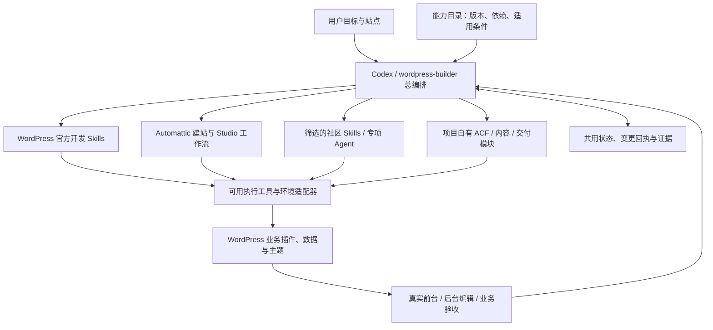

# WordPress × Codex：开放能力整合与建站总编排方案

研究日期：2026-09-19，Asia/Shanghai（UTC+08:00）。状态：**历史研究与实施规划，保留当时判断；当前决策见 [统一架构](TARGET-ARCHITECTURE.md)，代表性对照见 [实测报告](acceptance/theme-comparison/README.md)**。

当前范围已收紧为**从干净环境新建站点及维护本方案建成站点**。暂不接管客户旧主题、Elementor 或其他 builder。下文涉及存量站能力的研究只作背景，不进入当前实施范围。0.3.1 已补默认 PHP 路线的功能参考站；0.3.0 已实现总入口重构、10 个官方模块随包接入、新站契约/检测/阶段证据接口；当前实现见 [ARCHITECTURE.md](ARCHITECTURE.md)。其余规划不能当作已完成。

后续资料采集已完成：见 [上游 Skill 研究库](../research/wordpress-skills/README.md)，含 9 个仓库的固定版本下载、完整索引和首轮适用性分析；不代表已采用上游实现。

适用目标：Codex 开发、迭代可长期维护的企业/产品/询盘型 WordPress 网站；用户要求 ACF、自由 HTML 设计、产品与分类模板，以及后台内容和图片可编辑。布局任意拖拽不是当前硬性要求。本文保留早期规划，不再作为当前架构真源；当前设计见 TARGET-ARCHITECTURE.md，当前实现见 ARCHITECTURE.md，早期修复证据保留在 [17 号报告](17-OpenAI系统审计与重构决策.md)。

## 1. 产品定位与总体决策

**本方案是以 Codex 为执行主体、整合官方和优秀开源 Skill/Agent/工具的 WordPress 建站与维护方案。我们维护总编排、模块之间的交接、项目约定与交付标准；专业能力优先直接使用合适的上游模块。**

这修正了前版偏向“自有 Skill + 官方知识参考”的表述：上游 Skill 可以承担完整专业工作流、使用随附脚本和验证工具，而非只被摘抄成我们的说明。具体接入需完成兼容与行为验证；下载研究不等于已经可调用。

### 四层责任

| 层 | 做什么 | 维护归属 |
| --- | --- | --- |
| 总编排 | 理解目标、识别站点、选路线和模块、安排依赖、保存状态、决定完成条件 | 我们的 wordpress-builder |
| 专业能力 | 插件、主题、区块、REST、内容模型、迁移、性能等专项实现与检查 | 官方/开源 Skill 优先，必要时薄适配或补充自研 |
| 执行工具 | 文件、REST、WP-CLI、Studio、Playground、部署和浏览器 | 已有工具优先，项目适配器补缺 |
| 状态与验收 | 共用站点身份、变更计划、操作回执、测试和恢复证据 | 我们统一契约，复用模块自己的检查 |

单个 Skill 不等于一个独立 Agent，MCP 也不等于 Skill。默认由当前 Codex 按需加载模块并执行；独立 Agent 仅在授权、任务可隔离且确有收益时采用。不另造模型推理循环或通用多 Agent 平台。

### 主题与环境是可选组合

- 当前企业/产品/询盘站：ACF 为用户要求；0.3.1 按自由 HTML 与字段编辑需求确定 PHP 混合主题为当前默认；需要整站可视化编辑时使用区块路线，成本对照保留为后续研究。PHP 并非总编排的硬性前提。
- 希望可视布局编辑或已有成熟区块站：可接入官方区块开发技能，以及适合环境的 Automattic 工作流。
- 新站范围：统一可控制的环境与依赖；已有客户主题和第三方 builder 兼容暂缓。
- 新站必须具备源码/运行控制权。REST-only 仅能维护本方案建成站点的内容，不能完成新站构建。
- Studio、Playground、目标主机是环境选择；根据可用工具接入，不由某个 Skill 名称推断已经拥有工具。

当前没有代表性证据证明某一套组合是所有 WordPress AI 建站的最优解。目标是为既定需求提供可验证、可维护的组合，并使组件可以替换。

## 2. 本次外部研究发现

### 2.1 已有直接面向 Codex 的官方生态，基础开发知识应复用

WordPress/agent-skills 有项目识别、插件、区块、REST、WP-CLI、性能、PHPStan、Playground 等专业模块，包含确定性检测脚本。其 README 明确包括 Codex；本次读取的兼容政策以 WordPress 7.0+ 为目标。不能把这些默认假设直接套到较旧客户站。[S1][S2]

建议：项目范围选取所需模块，记录来源、许可证、版本或提交、局部修订与适用环境。首批评估 triage、plugin、REST、WP-CLI、Playground、PHPStan；区块相关模块仅在对应路线加载。不要全局安装全部技能，也不要把第三方路由器与我们的路由器同时设置为互相调用的入口。

### 2.2 Automattic 已提供更完整的建站集成，应评估“采用”而非默认自研

Automattic/build-with-wordpress 的当前 README 列出 Codex 输出、Studio MCP、WP-CLI 接入和验证能力；它明确以 Studio 为运行环境。它和 WordPress/agent-skills 是不同仓库，不能混称为同一个官方框架。[S3]

本次检查了仓库说明和 skills 目录，并抽查路由、建站、主题 Skill；未安装或运行整个套件。仓库还包含遥测配置，因此采用评估应核对安装产物与本项目需要，不能直接复制整套宿主配置。旧 Automattic/wordpress-agent-skills 的描述仍带有探索期定位，不能用它推断新项目的 Codex 支持情况。[S4]

关键反证：该项目的 theme-creator 明确选择 Block Theme，要求 Site Editor 可编辑和区块有效性验证。因此，不能将 Automattic 的这套建站工具引用成“官方推荐 PHP 主导”的证据。采用整个默认建站流程会带入这一架构选择；若选择 PHP 路线，只评估其环境/运维能力的复用，不能同时加载相互冲突的主题生成规则。[S21][S22]

建议：以 Studio 官方组合为独立实验变量，核验源码映射、日志、WP-CLI、版本、导入导出以及自托管部署边界。能够可靠替代的环境脚本就采用；不匹配我们 ACF/自托管路线的部分保留适配器。先不重写稳定的 REST 客户端。

### 2.3 内容运营接口与编码建站是两种能力

WordPress.com 的 MCP 已公开支持内容创建、更新、分类与媒体信息维护；这是特定平台提供的能力，不能等同于任意自托管 WordPress 已有相同接口。[S5]

WordPress MCP Adapter 将 Abilities API 暴露给 MCP 客户端；它是能力连接层，不会自动赋予主题部署、ACF 迁移和恢复能力。[S6]

建议：内容读取/写入使用现有 REST；源码与运行维护使用文件、WP-CLI 或宿主适配器。未来 MCP 包装同一份受控动作契约，不另建一套业务逻辑。仅为 Codex 建站不要求在生产 WordPress 中额外加入 LLM 推理插件；如果网站自身需要 AI 功能，再单独评估。

### 2.4 PHP 混合主题可行，但区块路线并非只有“随意拖拽”一种编辑体验

官方说明支持经典 PHP 主题结合 theme.json 和区块能力。[S7] 区块的 contentOnly 能限制设计操作、保留内容编辑；动态块可使用 PHP 渲染，block.json 是官方推荐的注册元数据方式。[S8][S9]

这修正了上一轮过窄的二分：**不需要全站布局编辑，并不足以单独排除 Block Theme。** PHP 候选的理由是本项目自由模板与结构化字段的需求，以及少维护一层区块编辑映射的潜在收益；实际收益须用对照实验确认。block locking 是编辑体验约束，不是后端权限边界。

### 2.5 内容模型独立、字段定义受版本控制

WordPress 官方建议 CPT 放在插件中，避免随主题切换失去管理入口。[S10] ACF 支持 PHP 注册字段，也支持 Local JSON；前者不能在字段组管理界面直接修改定义。[S11][S12] ACF REST 的写入 schema、读取格式和 PHP return_format 要分别处理。[S13]

建议：当前项目保留 PHP 字段定义作为默认权威源，运营编辑值，开发修改 schema。客户确实需要后台修改字段定义时，可以选择 Local JSON 工作流，但一个字段组只选一个权威源。ACF Blocks 属于 PRO 能力，不能按免费版已具备规划。[S14]

### 2.6 快速实验与交付环境验证都需要

WordPress 官方介绍了 Agent 使用 Playground、HTTP 与浏览器工具形成迭代验证循环。[S15] wp-env 文档区分默认 Docker 环境和实验性的 Playground runtime，数据库等能力存在差异。[S16]

建议：保留 Playground 做快速样板与隔离回归；增加目标 PHP、数据库和插件版本的测试环境。Studio 是环境候选，不是 MySQL/生产兼容性的自动证明。现有实验站实际版本与启动参数不一致的问题必须先解决，不能继续写着一个版本、验收另一个版本。

## 3. 目标架构与所有权

下表描述网站产物归属。无论使用哪个 Skill 生成，内容模型与主题的所有权规则保持一致。

### 内容与代码归属

| 对象 | 权威位置 | 编辑方式与边界 |
| --- | --- | --- |
| 产品/案例类型、分类、业务能力 | 站点业务插件 | 开发管理，插件注册与迁移 |
| 业务字段 schema | 业务插件内 PHP 定义 | 稳定 field key；版本化、显式迁移 |
| 标题、摘要、正文、主图 | WordPress 原生字段 | 不再在 ACF 复制同义字段 |
| 产品参数、业务关系、分类介绍 | ACF post/term 字段 | 后台编辑、REST schema 校验 |
| 页面专属呈现字段 | 主题内独立定义模块 | 内容值留在数据库；换主题时保留数据并映射 |
| 企业联系等跨主题信息 | 业务插件管理的配置对象 | 依据现有授权与 ACF 版本选择设置页/字段载体，不暗含 PRO |
| 布局、组件、字体与样式 | 主题源码 | Git 管理；不写死产品 ID/域名 |
| 主菜单 | 所选路线的原生导航对象 | PHP 菜单和区块导航各有适配；不同时作为权威源 |
| 媒体文件与附件属性 | 上传目录/媒体库 | Git 记录引用或迁移清单，不提交私有素材和完整数据库 |
| 表单、SEO、缓存 | 已选插件的配置与数据 | 每类单独适配；沿用站点已有插件优先 |

媒体默认通过附件 ID 关联，前台使用 WordPress 图片函数及尺寸能力；导入时保存源标识到目标 ID 的映射，不把一个环境的 ID 直接复制到另一个环境。只把需要跨页面、查询、验证或复用的数据建成独立字段；普通叙述保留正文。

业务插件按站点生成或配置，当前挖掘机专属字段不是通用 B2B schema。只在第二个行业项目证明共性后提取共享代码，避免先造大型元模型框架。

### 默认 PHP 路线

- 经典主题入口与标准模板层级；完整 header.php/footer.php、首页、归档、详情、taxonomy、普通 Page、文章、搜索、404。
- theme.json 定义可共享的样式设置；主题 CSS 使用明确组件，不要求每条 CSS 都来自 token。Gutenberg 用于正文与确实需要编排的区域。
- 模板获取字段后传给可复用 PHP 组件；不在多个模板复制完整文档壳，不把所有逻辑堆进 functions.php。
- `get_header()`、`get_footer()` 与标准 hooks 正常使用。按真实区块和脚本加载验证资产，不把现有混搭主题的预渲染补丁变成所有主题的永久规则。
- 移动菜单选一套实现并覆盖键盘、焦点与打开/关闭状态。避免为复用区块菜单而重新引入两套完整页面壳。
- 表单和 SEO 插件可替换；现有 Fluent Forms、The SEO Framework 是已用实现，不是 Skill 的全局硬依赖。

### 区块替代路线

- Block Theme 正常使用 HTML 模板、parts、theme.json、Patterns；业务插件继续持有同一套产品和 ACF 数据。
- 普通内容优先核心块；结构化产品显示按实际支持选 Bindings 或少量 PHP 动态块。需要的自定义块使用 block.json，不把整页 HTML 包成一个无法编辑的大块。
- 内容编辑用受限 Patterns/contentOnly；确需布局编辑才开放相应编辑能力。
- 建立文件与数据库模板覆盖的所有权规则；后台合法修改先导出、比较、合并，再部署。
- 不因测试方便故意让 B 路线使用更差素材、较少功能或不必要的付费依赖。

### 暂不引入的默认依赖

不默认采用 Next.js/headless、GraphQL、自制页面编辑器、完整 React 前台、ACF Flexible Content 页面搭建器、全站常驻模型调用或自建通用 MCP 平台。当前需求不足以抵消这些依赖增加的维护成本。已有客户站使用这些技术时属于本阶段范围外，不按新站标准强制迁移。

## 4. 执行工具的重规划

保留 TypeScript/Node 和当前客户端，不为了架构图整齐重写成另一种语言。初期在现有目录拆清职责即可，不需要立即改成 monorepo。

| 现有模块 | 处理 | 具体缺口 |
| --- | --- | --- |
| client、content-model、media、content、import-content | 保留并增强 | 复杂字段、term 字段、媒体跨环境映射；按真实 schema 工作 |
| journal | 保留日志与恢复机制 | 当前是任务目录锁；不是跨任务/跨主机站点锁，也不是服务端原子并发控制 |
| build-site、blocks | 限定为原生块页面适配器 | 不能继续称为任意主题/整站编译器；不无限扩展私有页面 DSL |
| templates、navigation | 按路线拆适配器 | 目前区块部件路径不能当作 PHP 主题导航接口 |
| release | 提升为共享发布服务 | 当前校验入口集中在 CLI build 发布；字段更新、文件部署、直接库调用不自动覆盖 |
| deploy-lab、lab、test-theme | 保留实验用途，抽取最小环境接口 | SQLite 备份与 Playground 重启规则不直接推广到生产主机 |

建议新增一个小型站点契约（拟定名称 `site-contract.json`，不是已实现命令），集中记录：站点身份、实际环境版本、主题模式、内容 schema 版本、文件/编辑器所有权、可用权限、适配器和已知限制。命令是否可用必须同时参考本地实现和目标站点能力，不能把配置里写着 true 当成功探测。

动作生命周期沿用 plan → diff → apply → readback → verify。代码、schema、内容、全局设置是不同恢复单元；跨单元执行是带检查点的流程，不伪称 WordPress 提供跨 HTTP 的完整事务。

并发保障分级：纯 REST 模式保留写前指纹与写后核验，并明确仍有竞态窗口；本地主控环境可增加站点级调度锁；需要强冲突保护的受管站，再开发服务端有版本前提的命令。不能通过多加一次 GET 宣称解决原子性。

发布依据改成“变更范围决定证据”：单字段修改验证字段、前台和冲突；主题修改验证模板/交互/编辑/回归；结构迁移验证数据与恢复。整站发布才要求整站证据。现有 release JSON 的人工状态文字与本地文件哈希不能自动证明线上部署字节、业务操作结果或浏览器验收真实性。

生产代码部署优先使用目标主机已有发布机制；数据库只迁移本次变更，不把测试数据库整库覆盖上线。WP-CLI 可参与导出与序列化安全的 search-replace，但这些命令本身不是完整备份策略。[S17][S18]

## 5. 能力组合与总编排设计

### 5.1 首批专业模块如何分工

以下为候选接入表，不是已安装能力声明。版本使用研究库中的固定提交；通过对应验收后才进入启用清单。

| 工作 | 候选模块 | 接入方式与边界 |
| --- | --- | --- |
| 本地项目识别 | 官方 wp-project-triage | 优先直接调用检测流程；适配路径，结果与远端 doctor 合并 |
| 插件与后端 | 官方 wp-plugin-development、wp-rest-api | 执行专业流程；保留上游引用与脚本，我们补站点契约 |
| ACF 业务模型 | 官方插件/REST 技能 + 自有字段/迁移模块 | 保留本项目 ACF 要求，补免费/PRO、字段所有权与数据迁移；参考 Respira 建模，不能虚构其工具 |
| PHP 主题 | 自有 PHP 混合主题专项流程 + 官方 API/运维/分析模块 | 填补所选上游组合的覆盖缺口；不调用强制区块主题的生成器 |
| 区块主题 | 官方 wp-block-themes、wp-patterns、wp-block-development | 按任务加载；同一生成阶段只指定一个主题流程负责人 |
| Studio 建站 | Automattic site/theme/block/plugin-creator 与 studio | 依赖、许可与兼容验证后采用完整适用流程；其子路由限定在本站点任务内 |
| 环境与维护 | 官方 wp-playground、blueprint、wp-wpcli-and-ops；可选 studio | 一个目标环境对应一个明确主适配器，不反复创建平行站点 |
| 类型、性能、专项审查 | 官方 wp-phpstan、wp-performance；可选审核后的社区模块 | 按变更触发，不将所有审查变成每次改稿的前置条件 |
| 存量 builder 迁移 | 暂不接入 | 仅保留研究，不进入当前能力包 |
| 业务验收与恢复 | 各模块验证 + 我们的统一交付流程 | 上游检查结果带证据交回，总编排补跨模块业务验收 |

不同时加载官方 router、Automattic 总路由和我们总路由让它们互相循环。我们的入口选择专业模块；上游有自己的子路由时，限定其输入范围与输出任务。出现同名 Skill 时按来源/版本标识解析，不任意覆盖本机已安装技能。

### 5.2 直接复用、适配、自研的选择

1. **直接复用**：目标、权限、环境与工作流匹配，使用固定版本的原模块，保留其脚本、引用和许可证。
2. **薄适配**：主要流程合适，仅路径、工具名称、任务输入输出等不同，在外层做映射；不得把工具名机械替换成语义不同的命令。
3. **受控派生**：确需修改规则时保留来源与独立补丁，记录为何不能直接使用；避免复制一份后失去上游更新关系。
4. **补充自研**：确有需求且现成能力不足，例如我们的 ACF 场景、跨工具写入回执、发布后的询盘保护。缺口明确后再做。

用户已有授权和项目约束持续有效；上游重复确认、特定宿主遥测或无关发布流程不自动扩展本任务。正式采用前明确适配差异，不能悄悄删掉关键保护后仍宣称原模块未修改。

### 5.3 能力目录与版本管理

拟定 `capabilities.json`（尚未实现），每项保存：能力 ID、上游仓库与固定 commit、Skill 路径、随附资源版本、适用 WordPress/PHP/ACF 范围、所需工具与权限、输入输出、允许修改的对象、验证方法、替代模块和采用状态。

采用状态区分：研究快照 → 已审阅 → 隔离测试通过 → 项目启用。工具在当前站点不可用时，该能力应标为不可执行，即便 Skill 已安装。升级先固定新版本、看差异、跑受影响用例，再切换；保留旧版本。不要在每次用户任务中自动追踪 latest。

初期用小型清单、正常 Skill 加载和现有 CLI 完成组合，不开发复杂插件市场、动态调度服务器或新的配置语言。拟议目录不代表现有工具已经支持它。

### 5.4 一个用户入口，按任务组织流程

| 模式 | 何时使用 | 最小输出 |
| --- | --- | --- |
| 研究/审计 | 选型、诊断、架构评估 | 来源、发现、能力边界、建议和验证计划 |
| 新站构建 | 有代码/环境控制权 | 站点契约、模型、模板、内容、验收和交付 |
| 本方案站点维护 | 新站完成后的内容/代码迭代 | 局部计划、差异、相关回归 |
| 内容运营 | 文案/图片/产品/导入 | schema 映射、冲突检查、回读 |
| 迁移与发布 | 模型升级、环境迁移、上线 | 版本证据、恢复单元、切换和恢复记录 |

总编排只加载当前步骤所需模块，保存选择原因与结果。一个字段修改不走整站八阶段。官方能力按专业任务运行，我们的流程按用户结果判断完成。

### 5.5 模块间交接与状态

每次交给专业模块的最小任务包：用户目标与完成条件、站点身份和目标环境、当前版本/路由选择、相关文件和对象、允许变更范围、已有授权、前置成果、需保留的内容。无需把整个会话交给每个模块。

返回最小结果包：完成/部分完成/失败、变更文件和对象、操作回执、验证命令和结果、证据路径、尚未覆盖项、恢复信息。缺少验证不能仅凭成功措辞记为完成。

沿用已有 Journal 和任务目录增加必要元数据，不另存多份互相竞争的状态。流程是发现 → 计划 → 执行 → 核验 → 交付；失败回到具体未完成步骤。外部工具写入必须记入统一变更清单，但不伪称已有 Journal 自动拦截外部工具。结果未知先读取工具回执与远端状态，不能直接切换另一工具重发同一操作。

同一数据对象避免不同模块同时写入；缺少服务端原子控制时诚实记录竞态边界。模块自己的单元检查与总编排的业务验收互补，不重复运行无关全套测试。

### 5.6 一次完整建站如何运行

1. 总编排读取企业需求，调用官方项目识别与当前远端发现能力，确定站点身份、已有资产及权限。
2. 确定内容模型和编辑方式，选择 PHP 或区块组合，以及实际可用环境。生成一个共用站点契约。
3. 插件模块建立业务结构，ACF 模块定义字段与迁移；主题模块消费同一模型生成模板，不重新发明字段。
4. 内容模块上传媒体、映射 ID、写入内容；依赖 ID 的导航与内部链接随后补齐。
5. 各专业模块交回检查结果；总编排验证运营后台修改、前台展示、菜单、询盘和恢复这些跨模块行为。
6. 在已有授权及相应验证完成后发布，保留交付记录；下次改稿从该状态继续。

### 5.7 我们仓库要维护什么

- `wordpress-builder/SKILL.md`：简短总入口、任务分流和必要约束。
- 能力/版本清单：启用哪些官方与开源模块，以及适配边界。
- 项目参考：架构选择、ACF、内容与媒体所有权、整站成果和交付要求；专业细节链接到实际采用版本，减少重复抄写。
- 现有 TypeScript 工具与必要环境适配器：保留有效能力，补真实缺口。
- 任务状态与行为用例：验证多模块能否共同完成结果。
- 研究目录：原始来源，不自动纳入启用路径。

本阶段仍在现有仓库组织，不为分层先拆出多个包或独立服务。用户配置的 Codex 负责推理，WordPress 执行工具不重新实现模型 SDK 或账户管理。

## 6. 比较实验与验收标准

先用全新隔离站进行 A/B：A 为 PHP 混合主题，B 为 Block Theme + 受限 Patterns + 必要动态块。两者使用同一 Brief、同一素材、同一 ACF 模型和插件版本，覆盖首页、产品归档、分类、产品详情、文章、联系、搜索与 404。保持模型与努力级别一致并记录工具版本；每条路线至少独立复跑一次，报告所有失败和人工干预。

不是先算一个主观综合分，再宣布默认方案获胜。按以下硬要求和真实成本决定：

| 实验 | 必须观察的结果 |
| --- | --- |
| 首次建站 | 无需沿用演示数据库即可构建；页面、导航、表单和 CMS 编辑成立 |
| 非开发者修改 | 改标题/主图/参数/分类介绍/正文，前台正确回显且不破坏结构 |
| 布局修改 | 改产品页一个区段，内容值和其他页面不被重写 |
| schema 升级 | 新增/重命名一个业务字段，旧值有映射，重复迁移不重复破坏 |
| 中断与冲突 | 请求结果未知、另一编辑者改内容时不盲目重复写入或静默覆盖 |
| 环境迁移 | 更换域名/路径/数据库后，引用、链接、媒体与表单保持正确 |
| 更新与恢复 | 核心/ACF/主题的目标升级验证；恢复不会静默抹掉发布后新增询盘 |
| 换行业 | 第二个 Brief 无机械设备字段残留，不需要修改通用工具源码才能建模 |

成本记录：首建与改稿时间、工具调用数、可获得的 token 使用量、失败重试、人工干预、定制代码量、前后台一致性和额外依赖。性能比较保持缓存、内容和主机相同；先记录基线，再制定目标，不预先声称 PHP 必然更快。

Studio 对照另做：选择已经通过的同一套源码，比较现有 Playground 工具和 Studio 工作流。这样不会把主题路线差异错误归因于环境工具。

Skill 行为用例至少包括：只改一个字段；缺少源码权限的新站任务；不支持的旧站接管请求；保留数据库模板覆盖；ACF 免费版不生成 PRO 专属方案；复杂字段返回格式；未知写入恢复；旧 WordPress 版本；第二行业新站；跨会话接续。验证是否选对路径、守住内容边界并完成结果，而非要求回答固定句式。

## 7. 实施顺序与完成定义

| 阶段 | 工作 | 完成门槛 |
| --- | --- | --- |
| P0：基线与接入选择 | 核对实际环境；从已下载来源选择首批官方模块，明确许可、版本、路径和依赖 | 研究资料与启用清单分离；无虚构工具；既有数据与变更可追踪 |
| P1：最小总编排闭环 | 精简入口；接入项目识别、插件/REST、运维模块；统一最小任务交接与回执 | 能完成一个产品字段修改、一个小型代码变更和一次中断接续；实际用了上游模块 |
| P2：默认路线实现 | 先完成 PHP 混合新站参考；按实际可视化编辑需求验证官方区块路线，Studio/成本对照不阻塞交付 | 当前默认的编辑、改稿、路由和询盘成立；生产部署恢复另验收 |
| P3：全新样板站 | 从干净环境按所选路线新建完整站点；补字段、导航、模板与跨模块发布验证 | 页面、询盘、后台编辑与恢复成立，不依赖旧演示数据库 |
| P4：第二站与交付环境 | 新行业空白站、目标 PHP/MySQL、升级与维护验证 | 通用性与交付证据成立，发布版本化整合包与真实能力说明 |

先证明组合能执行，再扩大模块数量；主题对照不阻塞独立的编排接入。不会为支持可选路线而自研两套完整主题生成系统：合适路线交给上游模块，项目只维护必要适配。

整合包包含总入口、启用能力/版本清单、合法可分发的模块或获取方式、工具依赖、少量适配器和行为用例。用户可按场景启用，不要求安装整个研究库。

新增编排验收：同名模块不误选；工具缺失能正确降级且不伪报完成；专业模块不越过任务范围；规则冲突不会循环路由；替换一个模块后交接仍成立；升级失败能继续使用旧版本；跨会话不重复写入。首批通过后再按新站需求接入更多开发或审计模块。

新站选择经典 PHP 路线时，必须完整提供模板、菜单、钩子、正文渲染和后台编辑，并验证所有公开路由；不要通过删除区块主题的 templates/index.html 冒充完整实现。现有演示站保留为历史回归对象，不作为新站交付的数据库或架构前提。

## 8. 当前事实与未完成项

现有工作区：main，基准 HEAD `a49821fa88311b5fa59f4d0298b8a6f5b71bd7a1`，含前一轮未提交修复。初次研究时读取了 Skill、工具、业务插件和研究文档，未提交、未部署或修改网站数据；后续实现与本地参考站验证以当前架构和验收记录为准。

前一轮测试属于当前混搭实现，不能算新 PHP 路线或 Studio 的验收。初次研究时仅作调研；后续 0.3.0 已随包接入首批官方模块，实际实现状态见 ARCHITECTURE.md。Studio、A/B、生产邮件送达和 PHP/MySQL 完整版本矩阵仍未完成。最初研究时 GitHub API 批量请求曾超时；后续采集已固定 9 个仓库的研究快照提交，并校验 1068 个源文件。0.3.0 已有正式接入清单与官方 triage 执行验证；其余上游模块尚未完成全部行为验证，研究版本锁定不能算部署验收。

旧 12 号文档没有逐条可核验来源，其“生态验证/最优”措辞不作为架构证据。17 号文档记录的修复继续有效；本文替代的是未来选型与规划，不抹去旧失败和现有成果。

## 9. 官方与维护者来源

以下均在本轮访问，日期 2026-09-19。来源说明支持事实；本文目录设计、默认选择、验收顺序与成本判断属于本项目建议。

- S1：[WordPress/agent-skills](https://github.com/WordPress/agent-skills)，官方组织开发知识库；不是所有客户站的兼容性证明。
- S2：[Agent Skills compatibility policy](https://github.com/WordPress/agent-skills/blob/trunk/docs/compatibility-policy.md)，本次读取目标为 WP 7.0+。
- S3：[Automattic/build-with-wordpress](https://github.com/Automattic/build-with-wordpress)，Studio 集成与多宿主打包；本轮仅源码/说明调研。
- S4：[Automattic/wordpress-agent-skills](https://github.com/Automattic/wordpress-agent-skills)，早期主题/站点生成探索，应与 S3 区分。
- S5：[WordPress.com AI content management](https://wordpress.com/blog/2026/03/20/ai-agent-manage-content/)，2026-03-20，页面标注更新于 2026-05-15；特定托管平台能力。
- S6：[WordPress/mcp-adapter](https://github.com/WordPress/mcp-adapter)，Abilities 到 MCP 的桥接。
- S7：[Bridging the gap: Hybrid themes](https://developer.wordpress.org/news/2024/12/bridging-the-gap-hybrid-themes/)，PHP 主题与现代编辑能力的组合。
- S8：[Block Locking API](https://developer.wordpress.org/block-editor/how-to-guides/curating-the-editor-experience/block-locking/)，contentOnly 与块锁定。
- S9：[Metadata in block.json](https://developer.wordpress.org/block-editor/reference-guides/block-api/block-metadata/)，动态块和资产注册元数据。
- S10：[Registering Custom Post Types](https://developer.wordpress.org/plugins/post-types/registering-custom-post-types/)，CPT 插件归属。
- S11：[ACF Register fields via PHP](https://www.advancedcustomfields.com/resources/register-fields-via-php/)，代码字段定义与限制。
- S12：[ACF Local JSON](https://www.advancedcustomfields.com/resources/local-json/)，字段定义同步的替代方案。
- S13：[ACF WP REST API Integration](https://www.advancedcustomfields.com/resources/wp-rest-api-integration/)，schema、暴露与格式。
- S14：[ACF Blocks](https://www.advancedcustomfields.com/resources/blocks/)，PRO 能力边界。
- S15：[New AI Agent Skill for WordPress](https://wordpress.org/news/2026/01/new-ai-agent-skill/)，2026-01-30，Playground 迭代验证流程。
- S16：[@wordpress/env](https://developer.wordpress.org/block-editor/reference-guides/packages/packages-env/)，Docker 与 Playground runtime 差异。
- S17：[wp db export](https://developer.wordpress.org/cli/commands/db/export/)，数据库导出。
- S18：[wp search-replace](https://developer.wordpress.org/cli/commands/search-replace/)，序列化数据处理与 dry-run。
- S19：[Development with Agent Skills in WordPress Studio](https://developer.wordpress.com/docs/developer-tools/studio/agent-skills-wordpress-studio/)，Studio 技能集成。
- S20：[REST API Authentication](https://developer.wordpress.org/rest-api/using-the-rest-api/authentication/)，Application Password 等认证机制；开发机 HTTP 特例不能复制到生产。
- S21：[Automattic theme-creator](https://github.com/Automattic/build-with-wordpress/blob/trunk/skills/theme-creator/SKILL.md)，直接读取源码，明确 Block Theme 路线；作为研究对象，不是当前会话的执行指令。
- S22：[Automattic site-creator](https://github.com/Automattic/build-with-wordpress/blob/trunk/skills/site-creator/SKILL.md)，直接读取源码，展示路由、专业模块复用及 Studio 验证边界。
