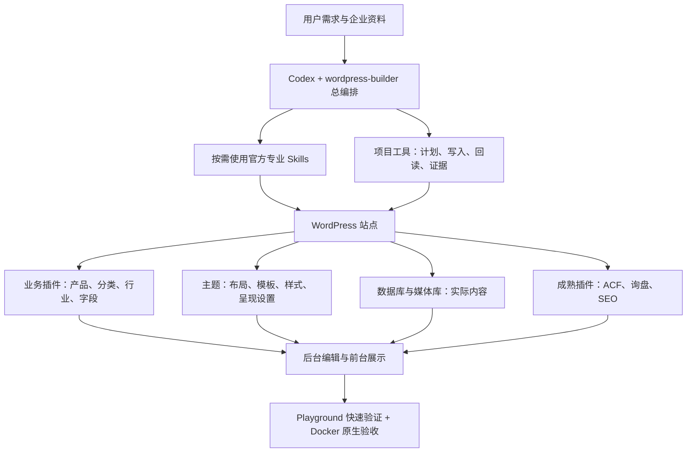

# WordPress AI 建站：现状、上手与模板能力

## CMS 后台编辑验收与操作入口（2026-09-20）

本节适用于当前 Hostinger 原生区块预览站，不适用于下文保留的经典 PHP 基线。管理员实际打开全部 58 条内容的编辑器；逐条草稿克隆验证保存和前台输出，并对以下关键流程执行真实浏览器操作。证据见 [CMS 验收](acceptance/hostinger-cms/report.json)。功能通过不代表视觉质量获批，真实邮件仍未验收。

| 内容 | 后台入口与操作 |
| --- | --- |
| 首页、About、普通页面 | Pages 编辑标题、正文区块和图片；共享布局到 Appearance → Editor 编辑对应模板。首页的共享模块不都在 Page 正文内。 |
| 联系页 | Pages 编辑正文，现在 Enquiry 模板会显示它；表单配置在 Fluent Forms，共享说明在 Enquiry 模板。 |
| 产品 | Equipment → Add Post，编辑标题、正文、主图；Meta Boxes 填 ACF 型号、重量、规格、工作范围、尺寸；侧栏 Template 选择 Standard、Editorial 或适用的自定义模板。 |
| 产品分类 | Equipment → Equipment families，编辑名称、描述和 catalogue/editorial 布局。分类图片当前由产品派生，没有独立分类图片上传字段。 |
| 行业方案 | Industries 编辑正文、主图及推荐产品分类关系。 |
| 文章和博客列表 | Posts 编辑文章；博客列表由 Site Editor 的对应归档模板控制，不能假设 Blog 页正文就是列表内容。 |
| 图片 | 编辑器上传或从媒体库选择，填写 Alt Text；保存后检查主图或正文图片和前台结果。 |
| 自定义模板、导航 | Appearance → Editor 中创建/修改模板及导航；修改共享模板会影响引用它的内容。用户新建的自定义模板已验证可用于产品。 |
| SEO | Rank Math 设置标题和描述；模板及插件保持单一输出负责人。预览站继续 noindex。 |
| 询盘 | Fluent Forms → Entries 查看入库条目；入库与真实邮件送达分别验收。 |

已实测草稿保存、发布、移入回收站与恢复，图片上传/替换、产品 ACF、分类布局、Rank Math 分类 SEO、自定义模板和导航保存。范围为当前管理员桌面浏览器，不声称所有角色、浏览器及插件全部功能均通过。

> 部署决策（2026-09-20）：当前只接入 Hostinger Managed WordPress，采用官方 CLI/API + SSH/WP-CLI，MCP 可选。详见 [部署规范](../.agents/skills/wordpress-builder/references/hostinger.md)。当前参考站的本地完整发布包、空白安装、询盘与 MySQL 恢复已通过 [发布包验收](acceptance/b2b-release/README.md)，命令为 `npm run test:starter:release`。Hostinger 只读预检工具已实现本地配置校验和回归测试（`npm run hostinger:preflight -- config/hostinger-staging.example.json`）；现已通过官方 CLI 的真实空白站开通和 WordPress 7.1.1 安装验证（[证据](acceptance/hostinger-onboarding/report.json)）；当前参考站的真实整站部署已通过 CLI TUS + 一次性 cron/WP-CLI 完成，包含 19 个产品、导航、首页/弹窗询盘，见 [线上验收](acceptance/hostinger-deployment/report.json)；同主机独立数据库/目录的 CLI 恢复已通过；SSH、原位回滚、跨主机恢复和真实邮件送达仍未验收；现有 build --publish 不是主机部署命令。

插件引导：必装清单见 [统一插件配置](../config/wordpress-plugins.json)，执行顺序与环境条件见 [插件初始化规范](../.agents/skills/wordpress-builder/references/plugins.md)。新站先安装并配置依赖，再生成页面；已有本地环境只读核对用 `npm run test:starter:plugins`。

> 当前新版入口为 [Equipment Studio 项目说明](../examples/b2b-block-starter/README.md) 与 [设计规划](../examples/b2b-block-starter/DESIGN.md)，本地预览 9490。首页/About 在页面正文编辑；产品填写 CPT/ACF 并选择原生模板；分类通过布局字段选择目录形式；导航使用原生 Navigation。新版询盘支持内嵌及当前页弹窗。下文标明“经典 PHP 基线”的限制不适用于新版区块项目。

> 2026-09-20 更新：新增 [原生区块代表页项目](../examples/b2b-block-starter/README.md) 及随包 `assets/block-starter`。两套产品模板、分类布局、Pattern 插入、官方 ACF 绑定和代表页 SEO 已有 [本轮证据](acceptance/b2b-block-starter/README.md)。旧 HONGDA 未迁移，完整商业站设计和生产交付仍未完成；下文 PHP 基线的功能限制只适用于该旧基线。

整套方案由项目 AGENTS.md、总编排 Skill、官方专业 Skills、按需规范、项目工具和验收证据共同组成。[仓库开发约定](../AGENTS.md) 管理本方案开发；每个新客户站按 [项目指令规范](../.agents/skills/wordpress-builder/references/project-instructions.md) 建立自己的 AGENTS.md，记录站点事实、代码归属、Skill 路由和实际验证命令。当前由 Codex 适配模板生成，`project-init` 尚未自动生成该文件。

核对时间：2026-09-20，Asia/Shanghai。当前工具版本 0.3.1。本文是新用户操作入口；组件实现以 [ARCHITECTURE.md](ARCHITECTURE.md) 为准，历史研究不作为已交付功能清单。

> 当前新站设计采用 [统一架构](TARGET-ARCHITECTURE.md)：原生区块主题 + CPT/ACF + 原生自定义模板 + 必要 PHP 动态模块，服务端输出适合抓取的 HTML。Skill 默认已更新，历史 HONGDA PHP 示例保留；当前 Hostinger 站使用已随包提供的 block-starter，具体功能以本文顶部 CMS 验收为准。

## 新站应怎样使用统一方案

让 Codex 定义产品/分类等内容模型，建立设计系统，再做首页、两套产品模板和分类归档。产品以同一个 CPT 存储，运营新增产品时选择批准的模板，填写原生标题/正文/主图和 ACF 参数；PHP 动态模块读取这些值。复杂布局由 Codex 编写 CSS/模块，用户不必拖拽建站。

首页/品牌页优先核心块和 Patterns，复杂规格与筛选用动态块。新站不因“只填字段”自动降为经典 PHP，也不因 SEO 要求改成静态导出。核心内容和链接在初始 HTML 输出，按 [SEO 规范](../.agents/skills/wordpress-builder/references/seo.md) 验证分页、规范网址、结构化数据和性能；不承诺 Google 收录。

当前可选择的起点：

- 复验现有完整功能链：使用下文 PHP 基线和 hongda:* 命令。
- 按新架构新建：调用官方区块主题/块/插件工作流，借鉴 [独立实验](acceptance/theme-comparison/README.md)，补齐可安装骨架与项目验收；不要把 assets/php-reference 当成区块主题。

实验已验证两套产品模板的真实后台选择、ACF 回显、分类布局 API 和本地询盘；完整 Pattern 库、后台分类 UI、整站视觉/SEO/新部署验收仍待交付。以下细节明确记录主工作区 PHP 基线，不覆盖这些状态。

## 当前 PHP 运行基线的模板能力

**主工作区基线支持后台新建、编辑、发布产品；尚未合入实验中的产品/分类多模板能力。** 当前 HONGDA 有一套产品详情布局、一套分类布局；普通 Page 已有 Company story、Enquiry 两个命名模板。现有架构可以继续增加多模板，不需要重建内容模型。

“创建一个产品”“选择已有布局”“设计一种全新布局”是三种操作。前者运营人员已能在后台完成；后两者不能因 WordPress 本身有模板机制就当作本项目已交付。

| 目标 | 当前实际能力 | 证据与限制 |
| --- | --- | --- |
| 新建/修改产品 | Equipment 内容类型、标题、正文、摘要、主图、分类、5 个 ACF 参数字段 | 模型已注册；字段编辑保存与前台回显已验收。完整新产品所有输入项逐项后台点击尚未单独验收 |
| 新建/修改产品分类 | Equipment families 分类，名称、slug、父分类、描述；自动生成归档地址 | taxonomy 原生对象，前台显示名称、描述和所属产品 |
| 每个产品选择不同模板 | 尚未接入 | 当前 single-hd_product.php 为统一布局，没有注册面向 hd_product 的命名模板 |
| 每个分类选择不同模板 | 尚未接入 | taxonomy-hd_category.php 直接使用共同产品归档；没有分类布局字段和模板分派 |
| 普通页面选择模板 | 已有基础 | Company story / Enquiry 通过 Template Name 声明；不等于覆盖产品/分类 |
| 后台自由设计整站模板 | 当前 PHP 路线未提供 | Gutenberg 编辑正文；theme.json 不会自动把经典主题变成完整 Site Editor 模板系统 |
| AI 生成/维护模板代码 | 当前工作方式 | Codex 编排专业 Skill，开发和验证主题文件；不是运营后台中的可视化模板生成器 |
| AI 内容 CLI 直接选择模板 | 当前没有该输入 | content-plan 的 schema 未包含 template；现有区块 single-template 适配器也不是 PHP 多模板库 |

核对依据：[只读 REST 能力证据](acceptance/0920-template-audit/capabilities.json)、[业务模型](../examples/hongda-wordpress/plugin/site-model.php)、[主题代码](../examples/hongda-wordpress/theme/functions.php)、[分类模板](../examples/hongda-wordpress/theme/taxonomy-hd_category.php)、[CLI 输入](../src/content.ts)。REST 产品 schema 有 template 属性只证明 WordPress 接口存在，不证明主题已经提供任何可选产品模板。

## 整套方案怎么组成

- 总编排整合能力；10 个官方模块固定版本随包管理，其他优秀开源实现先研究，再按需要接入。不是把所有工具同时运行，也不是另外部署一个多模型调度服务。
- 当前 HONGDA 运行基线为 **WordPress + PHP 混合主题 + theme.json + Gutenberg 正文 + ACF 免费字段 + 独立业务插件**。标题/正文/摘要/主图优先使用 WordPress 原生能力，参数放 ACF，数据不埋进模板。
- 普通 PHP 模板负责展示，同一产品数据可以被不同模板读取；换布局不应创建另一份产品。
- 当前表单/SEO 示例使用 Fluent Forms、The SEO Framework；品牌不是架构级永久硬依赖。WP 内容保存在数据库、图片保存在媒体库，AI 是建站与维护执行者，访问网站不要求运行 AI。
- 新站规划已采用区块主题整合方案，既支持 Codex 设计和运营填字段，也可提供受控 Site Editor 入口；与 HONGDA 等价的全套新骨架交付仍未完成。

## 目前进度

| 阶段 | 结果 |
| --- | --- |
| 新站范围与责任划分 | 已明确；支持本方案新建站的后续维护，不接管旧主题/Elementor |
| 编排和官方 Skill 集成 | 已实现入口、固定版本校验、阶段证据和内容工具；不是所有官方模块都已逐项行为验收 |
| B2B 参考站 | 首页、产品总览/分类/详情、行业方案、About、询盘、文章、搜索/404 已实现 |
| 内容编辑 | 原生内容/字段可维护；后台 ACF 保存及前台回显、CLI 写入/安全重放已验证 |
| 本地技术闭环 | ZIP 安装、页面/业务链、询盘、本地 SQLite 与真实 MySQL 恢复、真实 SMTP 测试邮箱收件、容器重建持久性已通过 |
| 易用模板产品化 | 产品/分类多模板库和统一选择体验待建设；新用户还需 Codex/实施人员组织项目与环境 |
| 视觉与真实项目交付 | 当前设计未获用户认可；另一行业的独立 Brief、目标主机和真实邮件投递尚未完成 |

证据：[Playground 完整闭环](acceptance/hongda-e2e/README.md)、[原生 MySQL/SMTP 验收](acceptance/hongda-native/README.md)、[后台编辑与页面检查](acceptance/0920-hongda/README.md)。因此当前应称为“技术链已验证、可继续产品化的 AI 新站方案”，不称为“零配置一键生成任意优质网站的平台”。

## 新用户如何快速开始

### 1. 首次安装由 Codex/实施人员完成

需要 Codex 能读取 Skill、控制新站源码与 WordPress 环境。仓库使用 Node.js 22+，先执行 `npm ci` 和 `npm run build`，再运行 capabilities 核对模块。独立分发必须复制整个 wordpress-builder Skill 文件夹，而不仅 SKILL.md。详细命令见 [仓库入口](../README.md) 和 [执行接口](../.agents/skills/wordpress-builder/references/runtime.md)。

需要复验经典 PHP 基线时从 `assets/php-reference` 复制源码或以 HONGDA 为起点；新架构项目按官方区块主题骨架建立源码，复用业务模型并逐项验证；不能修改 vendor 官方模块来承载客户页面。每个客户独立源码、数据库、媒体和契约。现有 hongda:* 命令是该示例的启动/验收工具，不是接收任何 Brief 的通用网站生成器。project-init 记录契约，不负责自动安装 WordPress。

### 2. 用需求描述让 Codex先做一组代表页面

可直接这样描述：

> 使用 wordpress-builder 为一家工业泵供应商新建英文 B2B 网站。采用原生区块主题 + CPT/ACF + 多套原生模板 + 必要 PHP 动态模块的统一架构。核心内容服务端输出，按 Google SEO 规范验证真实链接、分页、canonical 和结构化数据。先定义产品分类、型号、流量、扬程、材质及询盘字段，再实现首页、一个产品分类页和一个产品详情页；这些页面在实际 WordPress 中验收后，再扩展行业方案、About、Contact 和文章。没有真实资料的部分用明确标注的示例，不编造认证和客户。保存部署、编辑、询盘及恢复证据。多模板需求请先核对是否已实现，不能把计划写成已有能力。

Codex 应交付：站点地图、数据模型、代表模板、可访问预览、后台编辑方式、验证结果。行业参数由项目模型决定，不能把机械示例的重量/工作范围直接套给工业泵。

### 3. 页面怎样生成，以及以后在哪里修改

| 页面 | 首次建站做什么 | 运营者以后做什么 |
| --- | --- | --- |
| 首页 | 设计 front-page 布局、创建 Home 页面，在设置 → 阅读中指定静态首页 | Pages → Home 修改标题、主图、正文和已有首页字段；分类/产品区查询真实对象。当前部分标题/顺序仍在 PHP 中，要调布局需 Codex 修改主题 |
| 产品分类 | 注册业务 taxonomy 和分类模板 | Equipment → Equipment families 新建名称、slug、描述和父分类；给产品选分类后，分类列表自动生成。不在 Pages 中再创建同名“分类页” |
| 产品详情 | 设计统一详情模板和业务字段 | Equipment → Add New，录入标题、摘要、正文、主图，填写 Machine specifications，选择分类，预览后发布 |
| 行业方案 | 定义 solution 内容类型及版式 | Industries → Add New，编辑工况/选型正文、摘要和关联设备分类 |
| About | 创建普通 Page 并分配 Company story 模板 | Pages 中修改该页正文等已有内容字段；改变结构需改模板 |
| 联系/询盘 | 创建 Page、配置 Fluent Forms 与表单 ID、分配 Enquiry 模板 | 修改联系页内容和表单设置；普通产品 CTA 自动携带产品 ID |
| 文章 | 配置 Journal 页面和文章列表 | Posts 新增文章、分类和图片，列表自动更新 |

菜单名称以示例英文后台为准，翻译后名称可不同。操作能力以具有相应发布/分类/媒体权限的账号为前提。

### 4. 一个产品从草稿到发布

1. 先创建/确认分类，例如 Mini excavators。
2. Equipment → Add New：标题和 URL slug，填写摘要，正文用原生编辑器写特点、使用场景等，设置 Featured image。
3. 填写型号、重量和参数。当前机械示例的参数文本每行 `项目 | 值`，例如 `Engine power | 12 kW`；示例值不作为真实产品承诺。
4. 选择 Equipment families，先保存草稿，预览前台布局、图片、参数及询盘按钮。
5. 发布，检查分类列表和该产品询盘上下文。以后编辑同一对象，不为改版重复创建产品或随意换 slug。

这个过程不需要为每个产品写 PHP。但当前尚没有“产品模板 A/B/C”可选项，新产品仍使用统一详情模板。

### 5. 快速扩展内容

少量内容直接后台新增；大量资料让 Codex 做字段映射、媒体上传、CSV 计划与导入，先草稿再检查发布。内容 CLI 沿用 plan → apply → readback；当前不覆盖所有分类关系和模板选择操作，缺口使用已验证的 WordPress/WP-CLI 工作流并保留回执，不能声称一个 content-apply 包办全部操作。

复用的是模板和组件，不是复制整页 HTML 与参数。更改一个共享模板会影响使用它的多条内容；仅修改某产品参数只应改变该产品。

## 经典 PHP 基线如何补多模板（维护参考）

以下保留经典 PHP 基线的扩展方式；独立 A/B 实验已有代表性验证，尚未合入主工作区。新站默认模板注册方式见统一架构，不照搬 PHP 文件头作为区块模板注册方式。

| 对象 | 后台体验 | 与当前架构的衔接 |
| --- | --- | --- |
| 产品 | 编辑侧栏选择“标准参数型 / 图文展示型 / 方案型”等已注册模板 | 使用 WordPress 原生自定义文章类型模板，声明 Template Name 和 Template Post Type: hd_product；原生字段和 ACF 数据不复制 |
| 产品分类 | 分类新建/编辑表单选择“标准目录 / 对比选型 / 分类介绍”等布局 | 增加分类呈现字段存稳定布局键，由主题按白名单选择 taxonomy 展示片段；继续使用真实分类查询、分页、URL |
| 普通页面 | 选择品牌介绍、询盘、专题等布局 | 扩展已有 Page 模板机制，明确各模板适用页面与数据需求 |
| 首页 | 根据需求选择一套首页布局并编辑其内容 | 当前 front-page.php 优先负责首页，不能假设普通 Page 模板选择自然控制首页；需明确增加首页布局配置与路由 |

“用户构建很多模板”有两种不同交付：

- **用户描述需求，Codex 创建、部署并登记模板，运营人员在后台选择**：两种主题都可提供；本项目新站默认用区块 customTemplates + 动态模块实现。
- **用户完全在后台拖拽设计模板并保存新模板**：通过区块主题与 Site Editor 提供，按权限和覆盖维护规则开放；当前经典 PHP 基线未提供，不能仅加选择框就声称完成。

主题负责模板文件、允许的布局集合及呈现字段，数据库保存每个对象的选择。分类布局值不得直接拼接为任意 PHP 路径；删除/改名模板时回退默认布局并提示，不能留下白页。产品暂不自动继承分类模板，避免多分类冲突；若以后需要继承，单独定义优先级。

建议先各做两套确有不同信息结构的产品与分类模板，而不是预置大量雷同样式；配套后台说明、缩略预览、字段要求及 fallback。再让新用户完成“新建分类 → 选布局 → 新建产品 → 选布局 → 发布 → 切换模板”，验证刷新后保存、生效范围、URL/内容/字段/询盘不丢失。AI 工具如要选择模板，同步扩展输入校验、计划影响、回读与回归测试。

官方依据：[经典主题自定义模板与自定义文章类型模板](https://developer.wordpress.org/themes/classic-themes/templates/page-template-files/)、[WordPress 模板层级与 taxonomy 归档](https://developer.wordpress.org/themes/classic-themes/basics/template-hierarchy/)。核心具备可扩展机制，与当前项目已经实现的模板数量和后台体验要分开判断。
