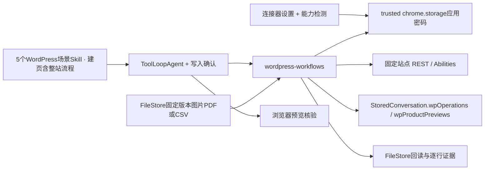

# 项目架构总览

核对时间：2026-09-07 21:36:56 GMT+8。面向新加入的开发者、AI Agent 与 Codex 任务。

本文依据主工作区 /Users/Zhuanz1/Documents/ChatGPT/浏览器网页批注插件 的现有源码编写。核对时分支为 codex/agent-workspace-sandbox，已提交 HEAD 为 e827bdf183d75144352cfba92ed42986a0327a7c（H05源码75bacf2，已含U01与H01–H04；INT01的Comet加载早于H04/H05，后两阶段主区检查/构建通过但尚未重载），同时存在多个任务的未提交修改。因此图中描述的是“所读取的工作区实现”，不将全部内容归属于该提交，也不代表浏览器已经加载了这些改动。各候选工作区是否已合并，统一查 [项目状态](PROJECT_STATUS.md) 与 [合并清单](harness-comparison-20260907/worktree-merge-ledger.md)。

## 1. 新任务先读什么

1. 根 [AGENTS.md](../AGENTS.md)：操作、协作与验证规则；先确认当前 worktree、分支和未提交修改。
2. 本文第 2—5 节：了解运行位置、模块职责与一次对话的数据流。
3. [PROJECT_STATUS.md](PROJECT_STATUS.md) 和 [Worktree 合并清单](harness-comparison-20260907/worktree-merge-ledger.md)：确认当前任务的源码基线、负责人和未合并依赖。
4. 按第 10 节的“改什么，从哪里开始”进入相关源码和测试，不必顺序读完所有历史报告。

术语约定：“产品 Agent”是扩展内为用户执行任务的系统；“开发任务/Codex 会话”是开发本项目的工作单元。worktree 是同一 Git 仓库的隔离源码目录，不是另一份浏览器数据，也不是另一套后端服务。

## 2. 产品与运行环境

章鱼外贸 AI 工具箱是 Chrome MV3 扩展，包含侧栏 Agent、网页快捷助手、批注/截图、文件与技能、翻译、视频/录屏等工作区内模块。当前 UI 以 TypeScript、DOM 和 CSS 实现，构建由 esbuild 完成；正式模型/工具循环使用 AI SDK ToolLoopAgent。本项目没有以 Next.js API Route 作为聊天服务端。

浏览器扩展后台承担服务入口，通过 provider 调用配置的模型服务。Node.js 用于开发构建/测试；产品内的文件代码执行使用隔离的 QuickJS，不是 Node.js 运行时。[构建入口](../scripts/build.mjs)、[依赖与命令](../package.json)、[扩展清单](../public/manifest.json) 是运行形态的直接依据。

~~~mermaid
flowchart TB
  subgraph Extension["Chrome 扩展"]
    Panel["侧栏：sidepanel / AgentPanel"]
    SW["Service Worker：background.ts"]
    Agent["AgentService → AgentRunner → ToolLoopAgent"]
    Quick["QuickService / TranslationService / CaptionTranslationService"]
    Driver["BrowserDriver / TaskGroup / NativeInput"]
    Data["Chrome storage + IndexedDB"]
    Host["共享 offscreen 宿主"]
    Frame["sandbox iframe → Worker → QuickJS"]
    Recorder["RecordingController"]
    Panel -->|"命令 RPC / 订阅 Port"| SW
    SW --> Agent
    SW --> Quick
    Agent --> Driver
    SW <--> Data
    Panel -->|"部分视图仓库访问"| Data
    SW -->|"隔离计算 / 录屏命令"| Host
    Host --> Frame
    Host --> Recorder
    Recorder --> Data
  end
  Page["网页内 content scripts：批注 / Agent 页面执行器 / 快捷 UI / 视频 UI"]
  Model["用户配置的模型 API"]
  External["已配置的连接器服务"]
  Driver <-->|"固定页面协议 / Chrome 原生输入"| Page
  Quick <-->|"各自的 RPC 与 Port"| Page
  Agent --> Model
  Quick --> Model
  Agent --> External
~~~

图中的模块是职责分组，并非每个框都独立进程。AgentService/AgentRunner 位于后台 service worker；offscreen 当前托管隔离计算和录屏，不承载正式 Agent 主循环。关闭或重开侧栏与重载后台是不同事件，不能认为关闭 UI 必然停止后台任务，也不能认为 Port 重连等于执行恢复。

### 运行入口表

| 宿主 | 源码 / 资源 | 职责 |
| --- | --- | --- |
| 后台 service worker | [src/background.ts](../src/background.ts) | 安装 Agent、Quick、翻译、字幕、截图、录屏等服务；路由扩展事件与批注状态 |
| 原生侧栏页面 | [public/sidepanel.html](../public/sidepanel.html)、[src/sidepanel.ts](../src/sidepanel.ts)、[AgentPanel](../src/agent/panel.ts) | 对话、设置、批注、附件与任务状态呈现 |
| 批注页面脚本 | [src/content.ts](../src/content.ts) | 页面选择、批注和样式相关交互 |
| Agent 页面脚本 | [src/agent-content.ts](../src/agent-content.ts)、[page-agent](../src/browser/page-agent.ts) | 安装固定页面观察/操作协议；不是接收任意模型 JavaScript 的入口 |
| 网页助手脚本 | [quick-content](../src/quick-content.ts)、[quick-ui](../src/quick-ui.ts) | 划词监听、按需 UI 和网页快捷操作 |
| 视频页面入口 | [video-assistant](../src/video-assistant.ts)、[video 模块](../src/agent/video/)、[模块说明](video-context/player-assistant-implementation.md) | 播放器、字幕、引用与侧栏衔接；侧栏与播放器通过后台 VideoSourceHub 共用当前字幕来源与轨道；VideoSettingsView复用于播放器和设置页，`octopus-video-settings` 桥仅开放字幕偏好，术语匹配复用网页翻译；共享翻译任务按字幕内容/视频身份/目标语言/模型术语隔离，双端被动订阅显式任务状态；格式失败缩小批次有界恢复，异步错误按请求代次处理；[本轮验收范围](video-context/subtitle-module-audit.md)对应未提交增量 |
| 共享 offscreen 页面 | [agent-sandbox.html](../public/agent-sandbox.html)、[ensureOffscreen](../src/platform/offscreen.ts) | 同时加载 sandbox-offscreen 与 recording-offscreen；协调宿主创建和就绪 |
| 受限计算环境 | [sandbox/client](../src/agent/sandbox/client.ts)、[offscreen](../src/agent/sandbox/offscreen.ts)、[frame](../src/agent/sandbox/frame.ts)、[worker](../src/agent/sandbox/worker.ts) | 指定文件输入，经 iframe/Worker 在 QuickJS 执行，返回结构化结果 |
| 录屏宿主与页面 | [recording/background](../src/recording/background.ts)、[offscreen](../src/recording/offscreen.ts)、[controller](../src/recording/controller.ts)、[main](../src/recording/main.ts) | 控制、采集、持久化与录屏 UI；编辑/导出有独立模块和 Worker |

网页助手当前模块边界、请求终态和弹窗行为见[网页助手模块现状](modules/web-assistant.md)，本轮覆盖与待办见[系统审查](audits/web-assistant-20260907.md)。

网页助手局部状态补记（2026-09-07 22:10:26 GMT+8，主工作区未提交）：[QuickBridge](../src/quick/bridge.ts) 在同一页面脚本上下文传递 composing 状态，由 quick-content 的 compositionstart/end 维护、quick-ui 消费以隐藏/恢复工具条；不经过后台 RPC。写作停靠几何由 [writing-toolbar-position](../src/quick/writing-toolbar-position.ts) 计算，手动位置由 QuickSurface 的 WeakMap 按编辑器元素保存，不写入设置。详见网页快捷助手 PRD 的“写作工具条定位实现”及过程记录0907-166。

content scripts 的安装和启停要从对应 service/driver 追踪；不能只看 manifest 是否有静态 content_scripts 就判断功能不存在。脚本被构建也不代表在所有页面始终运行。

## 3. 核心模块如何分工

| 模块 | 关键入口 | 负责的行为 |
| --- | --- | --- |
| 服务与会话控制 | [agent/background.ts](../src/agent/background.ts) 的 AgentService | RPC 校验、单个活动 AgentRunner、短控制操作串行化、会话读取/恢复、订阅分发和任务标签组衔接 |
| 模型与工具循环 | [agent/runtime.ts](../src/agent/runtime.ts) 的 AgentRunner | 组织工具、调用 ToolLoopAgent、消费模型事件、停止/引导、保存状态、发布 UI 变化 |
| Harness 应用层 | [harness](../src/agent/harness/) 的 ledger、approvals、completion、delivery、progress、tool-selection 等 | 执行计量、批准状态、进展、完成证据和工具选择；不把 UI “显示结束”当作交付验证 |
| 上下文与证据 | [context/manager](../src/agent/context/manager.ts)、[context/store](../src/agent/context/store.ts) | 模型工作上下文、摘要/检查点与外部原始证据管理 |
| 页面执行 | [BrowserDriver](../src/browser/driver.ts)、[TaskGroup](../src/browser/task-group.ts)、[NativeInput](../src/browser/debugger.ts) | 任务范围、页面/元素有效性、固定页面 RPC、受限原生输入 |
| 文件与成果 | [FileRuntime](../src/agent/files/runtime.ts)、[FileStore](../src/agent/files/store.ts)、[renderers](../src/agent/files/renderers.ts) | 任务文件、版本、解析、工具读写、发布和预览；文件写出与业务交付成功分开 |
| Skills 与提示词 | [skills](../src/agent/skills/)、[prompts](../src/agent/prompts/) | Skill 版本与任务引用、模板和库；Skill 文本不是新增 Chrome 执行权限 |
| 模型连接 | [providers](../src/agent/providers.ts)、[storage](../src/agent/storage.ts)、[data-consent](../src/agent/data-consent.ts) | provider 适配、配置/Key、连接验证与任务数据授权 |
| 连接器 | [connections](../src/agent/connections/) | 外部服务目录、配置、工具和结果衔接；依具体模块检查授权与副作用 |
| 展示与共享界面 | [transcript](../src/agent/transcript.ts)、[markdown-view](../src/lib/markdown-view.ts)、[design](../src/design/)、[i18n](../src/i18n/) | 消息视图、Markdown、设计样式与语言资源；共享渲染改动影响多个功能 |

跨模块共享时先找现有 model/protocol/schema、runtime/service/store，再决定增加接口。尤其不要因为类名含 runtime 就默认其执行位置：AgentRunner、Quick runtime、沙盒 runtime 和录屏控制器属于不同链路。

界面语言的工作区增量使用 i18next、显式 DOM 文案绑定与独立语言偏好。content script 通过只读 `octopus-ui-language` Port 获取语言，保留 local 存储的 `TRUSTED_CONTEXTS` 保护；后台只传递语言枚举。错误通过可选结构化 `failure` 传到界面，再本地化并定位恢复动作。详细边界和未迁移模块见 [界面语言与错误恢复](modules/interface-language.md)；这是未提交的核心界面接入，不表示全产品双语已完成。

U06 请求与上下文策略补记（2026-09-08 02:55:11 GMT+8，主源码整合 0ab8fcd）：[task-reasoning](../src/agent/task-reasoning.ts) 为已知 DeepSeek V4 主任务选择原生 thinking high，同时让 ContextManager 保留历史中的 reasoning；摘要/连接探针仍禁用，其他供应商沿用既有策略。官方 SDK 适配器承担字段分离与序列化，UI 最终索引不接收 reasoning；无 schema/Port 协议变化。详见 [Thinking 模块说明](Thinking模式与消息流分类核查.md)。主区137项、types/lint和独立构建通过；用户加载版本未更新，旧正文不重写。

U07当前安排：用户决定先完成内核评测与选型，前端消息体系重构暂缓；[六类消息研究](消息过程与最终结果设计.md)保留作选型后参考。

双内核研究状态：技术可行性研究已保留，产品最终只选一个内核，兼容适配和切换路由不实施。详见[最新范围决策](双内核前端消息展示兼容方案.md)。

## 4. 一条侧栏 Agent 消息如何流动

~~~mermaid
sequenceDiagram
  participant UI as AgentPanel
  participant S as AgentService
  participant R as AgentRunner
  participant M as AI SDK / 模型 API
  participant B as BrowserDriver / FileRuntime
  participant DB as ConversationStore / 证据与文件仓库
  UI->>S: agentRPC → agent:start / enqueue / stop 等
  S-->>UI: 命令回执（异步返回）
  UI->>UI: U04访问/期间状态校验 → 可接受时刷新显示
  S->>S: 校验 sender、schema、配置与任务范围
  S->>R: 创建或控制当前 Runner
  R->>M: ToolLoopAgent.stream(modelMessages)
  M-->>R: 文本、推理、工具及结束事件
  R->>B: 工具执行，经既有审批与范围检查
  B-->>R: 回执 / 文件版本 / 证据
  R->>R: DeliveryTracker 检查交付契约、版本与发布回执
  R->>DB: 持久化会话与关键状态
  R-->>S: StreamNotifications 发布 Conversation 快照
  UI->>S: agent:subscribe，textAppend:true
  UI->>UI: SyncStatusView显示同步进度，保留消息/草稿/任务state
  S-->>UI: agent:update 快照 / agent:patch 完整部件或追加
  UI->>UI: 订阅revision与显示接受校验 → 原子提交Decoder/显示 → Transcript → remend → 清洗
  UI->>UI: 有效订阅已接受 → 收起同步提示
~~~

此图表示主要职责与交互，不声明每个 token 都先落盘再发给 UI；持久化和显示通知各有调度策略。

1. 侧栏通过 [agent/model.ts](../src/agent/model.ts) 中的 agentRPC 使用 chrome.runtime.sendMessage 发命令，回复按 schema 校验。后台 [AgentService.install](../src/agent/background.ts) 验证命令和消息来源，Agent 命令入口限定来自扩展侧栏。
2. AgentService 维护活动 Runner、启动状态和控制队列；[inbox](../src/agent/inbox.ts) 处理排队/引导。后台对 Agent 的串行约束不等于所有快捷翻译和录屏也共用同一个循环。
3. AgentRunner 用 [providers](../src/agent/providers.ts) 创建模型，调用 ToolLoopAgent.stream，消费 result.stream，把文本、推理和工具事件映射到产品 Conversation。
4. 工具通过既有 BrowserDriver、FileRuntime、Skills、连接器等入口执行。modelMessages 作为模型历史保存；Conversation 用于产品展示，二者并不相同。
5. [StreamNotifications](../src/agent/conversation-stream.ts) 默认约 50ms 合并显示通知；[AgentRunner.changed](../src/agent/runtime.ts) 按关键事件或约 400ms 条件保存快照。这些是当前源码参数，不是可靠性 SLA，也不是每个 token 都完整重写 UI。
6. AgentService 为每个 Port 订阅创建 Encoder；首次订阅发送全量 agent:update，后续发送 agent:patch。协议包含 revision/base、消息顺序及部分内容更新。明确协商 textAppend 的订阅可接收文字/推理追加（验证类型与 UTF-16 原长度）；旧订阅仍收完整部件。异常增量原子拒绝后重订阅，不能当成直接转发模型 token。 U03增加内存published标记：该订阅已实时发布快照时，不再发送异步初始读取的晚返回。
7. [AgentPanel.connect](../src/agent/panel.ts) 解码更新并刷新视图；不匹配的增量请求重新订阅。Port 断开后当前实现约 1 秒重连，并通过 load RPC 重新读取会话。 U02第一阶段（源码90b88d，文档057d493）为回调绑定实际Port身份，恢复读取同时检查访问代次；旧连接/旧访问的返回不再切换当前会话。显式打开和发送使用captureSelection/ownsSelection保护，发送目标在第一次异步等待前固定。 U03（源码06f4383/文档69f530e）让切会话与重订阅使用新Port；receive区分accepted/ignored/resync/waiting，先通过与显示相同的接受检查才提交Decoder。旧首快照按1至30秒退避只读重试，等待期间的缺基线patch不绕过限速；新有效状态清理计时器。 U04（源码708534a，整合f7c496f）在选择票据中附带不可变快照引用；统一setConversationReply检查访问与期间状态，等时间戳晚RPC不覆盖已接受的新状态，严格更新的回执仍可显示。正常发送成功的草稿/附件确认不依赖显示回执被接受。 U05（fb74a1a/002e649）由SyncStatusView独立展示连接、重连、恢复状态；10秒期限共用，超时保留提示与只读重连按钮，有效订阅接受才收起。新会话立即清除旧超时，组件卸载清理计时器/监听；不改业务state或自动重发命令。
8. 后台重新读取存储时，遗留 running/awaiting-approval 状态会结合审批记录恢复或标为 interrupted，某些未结算工具结果标 unknown。需要恢复执行时重新核验页面；不承诺无条件重放副作用。

### 四类状态必须分清

| 数据 | 定义/保存位置 | 用途 |
| --- | --- | --- |
| Conversation / ChatMessage / parts | [agent/model.ts](../src/agent/model.ts) | 产品对话、工具状态、任务状态、附件/卡片、队列与问题；采用项目自定义 kind 等字段 |
| ModelMessage[] | [StoredConversation](../src/agent/storage.ts) 的 modelMessages | AI SDK 的模型输入历史，和展示结构分别维护 |
| 上下文/审批/Harness 状态 | [context/manager](../src/agent/context/manager.ts)、[harness](../src/agent/harness/)、StoredConversation | 检查点、批准/执行记录、恢复与完成核验 |
| 临时视图/传输状态 | [panel](../src/agent/panel.ts)、[conversation-stream](../src/agent/conversation-stream.ts)、[transcript](../src/agent/transcript.ts) | 会话访问代次、Port身份、订阅 revision、折叠/滚动、渲染节点缓存；不能替代后台持久状态 |

当前正式链路使用自定义 Conversation 协议，尚不能把它称作已经采用 SDK UIMessage/useChat。相关迁移由前端任务审计；“能读上游实现”“可用公开 API”“已接入产品”是三个不同阶段。

## 5. UI、网页通信与展示边界

项目目前有多条通信通路，各自的来源校验、序列化、生命周期和错误处理不能随意混用。

| 通路 | 主要协议/入口 | 作用 |
| --- | --- | --- |
| 侧栏 Agent 命令 | [agent/model.ts](../src/agent/model.ts)、AgentService | start/stop/queue/config/files/skills 等 RPC |
| 侧栏 Agent 更新 | [conversation-stream.ts](../src/agent/conversation-stream.ts)，Port 名 agent-panel | 会话订阅、全量快照和增量 patch |
| 批注侧栏同步 | [lib/protocol.ts](../src/lib/protocol.ts)、[background.ts](../src/background.ts)、sidepanel 的 panel:windowId Port | 批注、页面与工作区变化通知 |
| 页面固定操作 | [browser/protocol.ts](../src/browser/protocol.ts)、driver → agent-content/page-agent | 指定 frame 的观察与固定动作，含目标与结果校验 |
| 网页快捷助手 | [quick/model.ts](../src/quick/model.ts)、[quick/service.ts](../src/quick/service.ts)，Port 名 mr-quick | 网页来源身份、快捷生成、取消、收藏及向侧栏交接 |
| 网页翻译 | [translation/model.ts](../src/translation/model.ts)、[service.ts](../src/translation/service.ts)，Port 名 octopus-translation | 页面块翻译、来源校验与对应文档更新 |
| 字幕/视频 | [video/translation-service.ts](../src/agent/video/translation-service.ts)、[video/model.ts](../src/agent/video/model.ts) | `octopus-video-source` 来源订阅 Port 由既有字幕服务安装；[source-hub](../src/agent/video/source-hub.ts) 按标签/视频/分 P 合并读取和广播选中轨道，[source-client](../src/agent/video/source-client.ts) 服务侧栏；播放器连接先认证扩展/顶层文档/平台origin，允许初始首页/搜索路径；read/start及引用写入前以当前 frame URL/documentId 校验 SPA 视频来源。工作区未提交实现；侧栏 subscribe 与播放器 read 均可加入同一翻译任务，progress 明确 running/retrying/stopped/complete/error 及全量快照；引用快照独立冻结且兼容旧来源哈希 |
| 隔离计算与录屏 | [sandbox/model.ts](../src/agent/sandbox/model.ts)、[recording/protocol.ts](../src/recording/protocol.ts) | offscreen 命令、版本/任务标识和结果事件 |

[Transcript](../src/agent/transcript.ts) 按产品消息部分呈现工具、推理、结果和附件。[renderMarkdown](../src/lib/markdown-view.ts) 使用 marked 与 DOMPurify，在 Shadow DOM 中呈现；chat 模式复用分块节点，原始块 HTML 等情况走完整清理路径。Markdown 文本预览的图片会替换为占位说明；截图/附件和文件预览是其他呈现入口，不能推断整个产品都不支持图片。

已整合的 remend@1.3.1 仅补全运行中活动助手最后一个文本部件的显示副本；结束/暂停恢复原文语义，存储、复制和模型历史保持原始内容。源码为 markdown-view/transcript，协议与验证见 [流式模块说明](Agent流式消息性能优化与验收.md)。

Vercel AI Elements/Streamdown 的 React 实现可用于研究组件与流式处理。复用时应分别判断解析逻辑、公共类型、transport 与 React 生命周期要求。不要为了使用 useChat 就先把扩展整体迁成 Next.js。

## 6. 本地数据放在哪里

| 数据 | 存储 | 源码依据 |
| --- | --- | --- |
| 批注工作区 | chrome.storage.local 的 page-notes-workspace | [WorkspaceStore](../src/lib/store.ts) 与 background 的适配器 |
| 模型设置与 Key | chrome.storage.local / session；Key 按 rememberKey 与 profile 保存 | [agent/storage.ts](../src/agent/storage.ts)；读取与保存使用 trusted contexts，文档不记录实际值 |
| 模型任务数据授权 | 按连接记录在 chrome.storage.local | [data-consent.ts](../src/agent/data-consent.ts) |
| 界面语言偏好（工作区增量） | chrome.storage.local：octopus-ui-language-v1；auto / zh-CN / en | [i18n/runtime](../src/i18n/runtime.ts)、[只读网页桥接](../src/i18n/service.ts)；不与模型配置一起保存 |
| 会话 / 模型历史 / 运行状态 | IndexedDB：page-notes-agent，当前版本 3；conversations、summaries、deliveries | [ConversationStore](../src/agent/storage.ts)，同次 put 维护相应索引视图 |
| 原始上下文证据 | IndexedDB：page-notes-agent-context | [ContextStore](../src/agent/context/store.ts) |
| 任务文件与版本 | IndexedDB：page-notes-agent-files；heads、versions、usage | [FileStore](../src/agent/files/store.ts)，以 task/path 与版本管理 |
| Skill 版本 | IndexedDB：page-notes-skills | [SkillStore](../src/agent/skills/store.ts) |
| 提示词与收藏 | IndexedDB：mr-lei-prompt-library | [PromptStore](../src/agent/prompts/store.ts) |
| 快捷助手结果库 | IndexedDB：mr-quick-library | [QuickLibrary](../src/quick/library.ts) |
| 录屏分块 / 编辑草稿 | IndexedDB：octopus-recordings / octopus-recording-edits | [recording/store](../src/recording/store.ts)、[edit-store](../src/recording/edit-store.ts) |

录屏工作区未提交增量（2026-09-07）：[recording/lock.ts](../src/recording/lock.ts) 由媒体宿主持有同源 Web Lock，覆盖初始写入至最终保存；本地库查询锁状态并禁用活动录像，删除事务也需取得同一锁。宿主终止后浏览器释放锁，恢复只读取已提交连续分块，不改变 IndexedDB schema。实际验证及限制见 [录屏测试报告](录屏全流程真实浏览器测试报告-20260907.md)。

这张表列主要仓库；连接器配置、翻译缓存、视频状态等由对应模块维护，新增持久对象时应补文档并说明归属。前端内存、Chrome storage、各 IndexedDB 事务及文件版本不是一个全局原子事务。改变 schema 或持久化顺序前，应检查升级、重开、取消和部分提交情形的测试。

工作树隔离只隔离源码；测试仍可能共享浏览器 profile、扩展加载目录、端口与模型配额。选择隔离测试配置并登记实际构建版本，不能用另一个 worktree 的验证结果替代本次。

## 7. 文件交付、隔离计算与模型连接

文件工具将内容写入任务 FileStore，通过 expectedVersion 等版本约束处理并发与旧版本。发布的 artifact 固定文件版本；[文件预览](../src/agent/files/renderers.ts) 与 [Markdown 聊天渲染](../src/lib/markdown-view.ts) 分开。相关机制详见 [文件工作区与代码沙盒](Agent文件工作区与代码沙盒.md)。

H05 已整合固定版本分段读取：readFile向既有FileStore传递可选version，续读沿用回执version/nextOffset，offsetUnit明确为UTF-16；文件改稿/删除后仍可读已保存的历史版本。省略version仍读最新，因此跨次一致性依赖显式固定版本。ContextManager现有投影保留版本并按缩短片段重算游标，无新数据库schema/运行宿主/前端协议。详见同一[文件模块说明](Agent文件工作区与代码沙盒.md)。

runJavaScript 的链路是 FileRuntime → [sandbox client](../src/agent/sandbox/client.ts) → 共享 offscreen → sandbox iframe → Worker → QuickJS。输入是指定文件副本和本地打包的运行组件；隔离脚本不拥有扩展 API、网页 DOM、Node/npm 或网络代理。结果通过模型/schema 和文件版本等应用检查后再写回，不等于允许模型向任意网页注入脚本。

[providers.ts](../src/agent/providers.ts) 使用 DeepSeek、OpenAI-compatible、OpenRouter 等 provider 适配。当前 guardedFetch 检查配置的 origin、识图连接与任务数据授权，并设置 credentials omit、redirect error。连接器是另外的外部服务边界，不能把模型 API 授权当成所有连接器操作授权。

## 8. 当前正式实现与候选改造

本文不复制实时合并表。架构阅读时需要保留这些边界：

- 主工作区正式路线为 Vercel，H01/H02/H03 已随组合 e09e539 整合：交付契约与发布前检查、分页复核回执及幂等重试、首次登记前的数字字面适用性校验。见 [交付模块说明](harness-comparison-20260907/vercel-delivery-candidate.md)。未改变运行宿主和数据库 schema；有限词法检查不是全文语义验收，旧坏契约不自动迁移，真实业务内容复核限制仍保留。
- H04 来源复核范围诊断已随99b2c06整合：从旧回执真实归档回读当前文件版本的UTF-16范围，验证身份/文本后求并集，披露partial/unknown、缺口与来源边界上下文。无持久化schema迁移；原始字符含HTML/CSS，不能当成语义覆盖或来源完整性，不增加100%字符发布门禁。模块限制、主区192项相关回归与加载边界见H04；未确定性解决模型夸大复核范围或文章忠实度。
- H06验收限制（2026-09-08）：产品e827bdf的隔离MV3真实文章/恢复均未最终交付。固定历史版本读取有效，但错误结构检查可被接受并冻结，错误选段的pending回执继续阻塞；model-reviewed仍可能漏掉来源概率限定。该阶段仅增测试与证据，没有架构/schema/前端协议变更；修复尚未实现，见[实测报告](harness-comparison-20260907/vercel-h05-live-results.md)及唯一清单H06。
- H07 工具激活：wordpress组显式启用WP工具，默认不加载其schema；现有prepareStep向SDK及预算器传入同一activeTools，未修改运行宿主、前端协议或存储。已整合dbc0bef，主区组合验证结果见H07；WP业务schema由插件任务维护，H06交付失败仍待修复。
- H08 复核状态：源码3a4e7dc已整合至5e40a00，DeliveryState新增discarded与discardReason，pending可有理由作废、保留原归档与额度，已提交记录不可撤销；全部作废仍缺复核。旧记录可读，无数据库迁移，含新状态的任务不能假定旧版兼容。详见交付模块及H08；这不解决错误JSON检查或语义忠实度。
- H09 JSON交付契约：源码a97b2ae已整合，新增jsonObject直接字段/基础类型/exact检查；新或更正JSON登记必须exampleJson，在冻结前复用Zod验证结构自洽，拒绝时整单不改动。样例不替代实际文件数量、金额或语义核验；有效冻结要求保持不可自动改写，旧无样例jsonArray仍可恢复/原样重试。无数据库迁移，新对象契约不能假定旧代码可读。主区159项/types/lint通过，候选build通过；未做新真实业务验收，详见[H09记录](../process_docs/0908-29_Harness_JSON对象检查与冻结前自测.md)。
- H10 来源复核：f575185已整合aa7b31b。新空findings需comparisons逐字配对来源/成稿及判断理由，来源含原boundaryContext；changed/uncertain独立阻止发布。对照随DeliveryState保留、同页reviewComparisons可回读，已提交不覆写；异步取证后再核对当前回执，避免并发提交/作废覆盖。旧已提交记录原样兼容，旧pending首次空发现遵守新规则；无DB迁移，但旧代码不能保证处理新不利判断。引文校验不证明语义正确，候选160项/build和主区176项/types/lint不等于真实业务验收。见[H10记录](../process_docs/0908-36_Harness来源复核原句对照.md)。
- H11 真实验收边界：固定f575185的已存文章任务被explicitDeliveryPaths把来源描述误识别为交付路径所阻，未触达H10内容复核；JSON原v1在真实worker重载后发布，源v2保留。长继续消息会重新打开registered，现有files/scope可保留，不是丢库证据；恢复未显式version:1读取。本阶段只有测试/报告，无架构或协议变化；主区已整合97ae5bd，详见[报告](harness-comparison-20260907/vercel-h10-live-results.md)。
- H12 输出路径判定：源bf1bd26已整合04ee553。DeliveryTracker首次登记前跳过“保存的/生成过的”等来源描述，将“保存并发布”作为动作串，明确中文输出路径也触发交付契约；H11原文只约束slides.html。来源/计划不能代替真实输出，原冻结/复核/版本门禁保持。无新循环、依赖、协议或持久schema，旧坏契约不迁移；词法判定不是通用NL或语义验收。候选180项、主区182项及隔离构建/types/lint通过，用户dist未更新，真实文章待新版本复测。[记录](../process_docs/0908-54_Harness来源描述与输出路径误报修复.md)。
- H16共享反馈已集成（源72add95→主区a4393cc）：仅共享delivery.ts的工具schema说明与无效用户引用字段定位，官方DeepSeek HTTP模拟验证真实错误/三错停止原样；没有新字段、schema迁移、修复循环或执行器变化。源16文件292项/主16文件295项、types/lint/隔离build通过，零付费请求。[证据](</Users/Zhuanz1/.codex/worktrees/5977/浏览器网页批注插件/process_docs/0908-68_BX03交付登记失败离线复现.md>)。
- H17候选（5977，6361ab05e3eb，未合入）：DeliveryState的CSV检查rows可省略；省略只跳过精确行数比较，完整格式/表头/列数、来源复核与版本发布门禁保持，显式0仍精确。旧冻结不迁移，无DB升级；旧版登记器拒绝新省略字段，不能假定向后兼容或混用版本。字段说明不等于通用数字依据验证。12文件254项/types/lint/隔离build通过，零付费，源候选Pi已接入ac515409、H17真实CSV四阶段通过f1fb9d2（独立评测付费批次，非原254项离线阶段）；六项原生审查c777281允许固定配置系统比较，架构不变；正式主区仍H16，[H17记录](</Users/Zhuanz1/.codex/worktrees/5977/浏览器网页批注插件/process_docs/0908-71_H17_CSV未知数量最小修复.md>)。
- H15候选（5977，6406d5b已冻结/未合入）：基于H14接入BX03 ec206e2的21公共浏览器源、公开Puppeteer输入与I06恢复，增加受限打包插件和必要支持依赖；原生循环/上下文/provider/H14保持。33文件470项/types/lint/build、Chrome152输入18项及5模拟调用真实原生接线通过，无新付费业务。[候选模块与支持差异](</Users/Zhuanz1/.codex/worktrees/5977/浏览器网页批注插件/docs/harness-comparison-20260907/vercel-bx03-adoption.md>)；正式主区/用户加载架构不据此替换。
- H14共享修复已集成：源ea952ad→主区99296f8。新增parse5@8.0.1运行依赖及[harness/html-review-text.ts](../src/agent/harness/html-review-text.ts)/[literal-upper-bound.ts](../src/agent/harness/literal-upper-bound.ts)，公开AST/sourceCodeLocation提供受限HTML行内引文匹配；新literal.max须对应用户词法依据。保持原始UTF-16范围、固定版本/来源/不利判断和旧回执兼容，无schema/工具/SDK循环/宿主改变。源245项/主248项、types/lint/隔离build通过，源后台+169347字节，启动未测、用户加载未变。详见[模块](harness-comparison-20260907/vercel-delivery-candidate.md)及[整合记录](../process_docs/0908-64_H14共享交付修复精确整合.md)。
- H13真实验收边界：固定H12产品bf1bd26已越过路径误报，HTMLv3具备8页/3原图但24请求上限内未进行sourceReview或发布；QuickJS检查纠错、重复写读消耗步骤，内容限定和排版仍有失败。502168tokens，最后第25条尝试本地阻断未发网。报告已合入0af7ae9，只有观察/证据，无产品架构/schema变化；完整实际证据见[报告](harness-comparison-20260907/vercel-h12-live-results.md)。
- 前端 U01 的协商式 append 与 remend 已随 e09e539 整合。依旧原生 DOM/Chrome Port，未迁移 useChat；上文图与协议已更新。主区其他未提交功能保留，整体回归/构建/用户浏览器加载按 [INT01](harness-comparison-20260907/worktree-merge-ledger.md) 的分别证据判断。
- Pi 和 DeepAgents 是独立候选或历史对照；本架构图没有把其运行模型混入正式 AgentRunner。
- BX01共享执行器的[长期实施方案](research/shared-browser-executor-20260907/共享浏览器执行器实施方案.html)已形成（2026-09-08，方案文件未提交）：保留原生循环/现有存储与任务范围；在service worker内以单tab连接所有者接入Puppeteer浏览器构建，content script负责有范围的观察与采集。该后端尚未安装到主产品；隔离先导6通过2失败，需先修transport生命周期并验收公开输入、realm/CSP、业务身份及未知动作恢复。上方正式架构图不据此变更；公共协议和操作记录迁移在B0/B5实施后再同步。
- 主工作区的连接器、翻译、视频、设计系统等还有并行修改。本文把已观察到的代码入口列出来，功能完成度和验证状态由对应负责人维护。
- 新能力若要改变运行宿主、公开协议、持久化 schema 或核心职责，需要同时更新本文，并在状态/合并清单登记迁移范围和兼容计划。

## 9. 构建与验证入口

[package.json](../package.json) 定义日常命令，[scripts/build.mjs](../scripts/build.mjs) 决定实际产物，而非按 src 下文件存在与否猜测运行入口。

~~~sh
npm run typecheck
npm run lint
npm test -- tests/conversation-stream.test.ts tests/transcript.test.ts
npm run build
~~~

测试例子适用于消息链路修改；按实际变更选择测试。构建会重建所属工作区的 dist，还会生成部分 output/prototype 预览资源、打包文档解析资源、沙盒与录屏入口，并执行商店构建边界检查。不要从共享主工作区随意构建并覆盖其他任务正加载的 dist。

[vitest.config.mjs](../vitest.config.mjs) 选择 tests/**/*.test.ts 并加载语言测试初始化；它不会自动执行所有 live 脚本。模拟/离线测试、真实 Chrome 与真实模型业务验收分别记录。构建成功不证明网页交互、宿主重启或长任务业务正确。

## 10. 改什么，从哪里开始

| 需求 | 先读 | 优先验证 |
| --- | --- | --- |
| 发送、排队、引导、停止 | AgentPanel → model/agentRPC → AgentService → inbox/runtime | [agent-inbox](../tests/agent-inbox.test.ts)、[agent-questions](../tests/agent-questions.test.ts)、[agent](../tests/agent.test.ts) |
| 流式消息、工具状态、重连 | conversation-stream → panel.connect → runtime.changed → transcript | [conversation-stream](../tests/conversation-stream.test.ts)、[transcript](../tests/transcript.test.ts) |
| Markdown 与流式重绘 | markdown-view → transcript → 文件预览调用方 | [markdown-view](../tests/markdown-view.test.ts)、[agent-file-renderers](../tests/agent-file-renderers.test.ts) |
| Harness 完成判定、证据和恢复 | runtime → harness/completion、ledger、approvals → context | [harness-runtime](../tests/harness-runtime.test.ts)、[harness-completion-runtime](../tests/harness-completion-runtime.test.ts)、[context-summary-recovery](../tests/context-summary-recovery.test.ts) |
| 网页观察与操作 | BrowserDriver → browser/protocol → page-agent/debugger → TaskGroup | 页面观察与原生输入相关测试、实际目标页面回读；按任务安排 Chrome 验收 |
| 文件、版本与代码执行 | files/runtime → files/store → sandbox/client/frame/worker | [agent-files](../tests/agent-files.test.ts) 与 [tests](../tests/) 中 sandbox 用例 |
| 网页助手或整页翻译 | quick/service/runtime、translation/service/controller | [quick-runtime](../tests/quick-runtime.test.ts)、[translation-controller](../tests/translation-controller.test.ts)、[translation-dom](../tests/translation-dom.test.ts) |
| 字幕/视频 | agent/video 对应 service、client、player、evidence | [caption-translation-service](../tests/caption-translation-service.test.ts)、[video-agent](../tests/video-agent.test.ts) |
| 录屏/剪辑或 offscreen | recording/background/offscreen/controller、platform/offscreen、sandbox | [recording-offscreen](../tests/recording-offscreen.test.ts)、[recording-edit](../tests/recording-edit.test.ts)、[recording-lock](../tests/recording-lock.test.ts) |

定位问题时先确定“入口在哪个宿主、数据由谁持有、经过哪条协议、落到哪个仓库”，再跨模块查调用。不要仅修改错误显示处而遗漏后台状态与持久化来源。

## 11. 架构文档如何保持有效

具体执行规则统一在 [AGENTS.md 的文档维护章节](../AGENTS.md#文档维护)。各会话在功能/模块里程碑、关键验证、提交冻结、交接和合并时主动检查并更新相关文档，无需用户再次提醒；应更新的文档尚未完成时，不把该里程碑标记为交付完成。

实现任务更新与自身源码配套的候选架构/模块说明，并登记到共享状态；整合任务依据合并后的代码更新主文档。未合并能力只在候选说明中链接，不覆盖主架构现状。现有模块文档优先复用，缺失时创建 docs/modules 下的模块说明并补本页入口。多任务更新同一文件前重读并只改负责章节，保留其他任务新增内容。

- 本文维护跨模块结构；AGENTS 维护操作规则；PROJECT_STATUS 维护动态进度；合并清单维护源提交/目标/验收；process_docs 保留阶段证据。不要把所有历史日志塞入本文。
- 新增/移除运行入口、改变消息协议或状态归属、调整存储 schema、迁移框架或引入跨模块依赖时，在同阶段更新本文相应图、表和源码链接。
- 开工先核对当前工作区与主规则；修改本文前重读最新版，只更新本任务负责的结构，保留并行任务内容。
- 记录核对时间与源码基线；未提交变化或尚未合并候选明确标记。文档过时应依据源码修正，不能为了符合图而未经研究修改代码。
- 架构文件列出的现有设计不是永久不变的禁令。改进应说明具体问题、替换边界、兼容与验证，而不是仅因参考项目使用另一框架就整体迁移。

U02的会话访问代次用于隔离异步操作，不是跨RPC/Port的全局消息版本；U03已实现订阅内旧帧检查、Decoder/显示接受及新Port恢复，U04已补同访问等待期间的晚RPC保护；U05已提供可见连接/恢复及超时重连提示；回执先到而等时间戳跨来源快照后到、跨worker全局版本仍待后续。行为和证据见[流式与会话模块](Agent流式消息性能优化与验收.md)及[U02过程记录](../process_docs/0908-04_前端会话归属修复与整合.md)。本轮用户Comet加载由统一验收任务后续登记。

## WordPress 场景执行链（0908，主工作区增量）

源码入口：`connections/wordpress.ts`传输；`wordpress-blocks.ts`受控原生块；`wordpress-workflows.ts`内容/媒体/ACF/插件能力；`wordpress-tools.ts`12个工具；`wordpress-design.ts`只读主题档案与页面编译证据，页面模板写入由实际schema枚举约束。`files/import.ts`保留原始图片/PDF，PDF可附提取文本或提取失败说明。Skill目录`skills/builtin/wordpress`，统一复用WordPress连接器；DataForSEO文章与有限监测沿用既有实现。详见[实施契约与限制](modules/wordpress-workflows.md)。当前属于主共享工作区未提交增量；不代表已装载到Comet扩展。

### 界面语言跨入口补充（2026-09-08）

纯静态注入文案由 src/i18n/injected.ts 生成，captureIcons 的 getter 在每次调用时按当前语言取值；截图与录屏闭包只解析文本映射，既不导入运行时也不接触存储权限。普通侧栏/设置/内容Shadow DOM继续使用i18next +显式DOM绑定。settingsTargetSchema新增 apify/dataforseo/google/wordpress，SettingsNavigation先定位连接器页面；ProductFailure稳定代码及后台执行协议不变。详情使用showFailure，不把底层异常当作界面文案。

### 任务网页自动恢复（2026-09-08 01:55:36 GMT+8）

TaskGroup继续以session绑定作为任务范围真源；local保存原生documentId/tabId/groupId/windowId恢复证据，在session关联缺失时验证原存活文档后恢复绑定。该恢复不承担模型循环、不重放页面操作、不根据标题/编号扩大权限；删除对话和解除分组撤销恢复信息。工作区未提交实现与边界见[任务标签页分组设计](任务标签页分组设计.md)。Chrome原生getFrame覆盖此宿主需求，无新增第三方库或权限。

### WordPress标准建站组件（0908，工作区首版）

浏览器Skill→按需wordpress工具组→共享Application Password连接器→原生wp/v2及固定octopus/v1/site接口。`connections/wordpress-site.ts`负责配置与读回；站点端`wordpress-site/plugin/octopus-site`持有CPT/字段/有限设置，`wordpress-site/theme/octopus-trade`持有展示模板与原生字段绑定。两者独立版本，用户在WP后台安装ZIP；无本地伴随服务。`wordpress-site/build.mjs`生成安装包并由主build打入dist，WordPress配置页提供下载。动态字段与主题解耦；schema大数据保存在任务证据，不常驻工具上下文。当前未提交实现，未声称用户站点部署完成，详见WordPress模块。

### WordPress产品边界纠正（0908，覆盖此前主题捆绑方案）

扩展仅提供连接器/Skills/能力适配。wordpress-site/build.mjs现仅打包可选数据能力插件，不打包theme源码；连接器无主题下载，wpConfigureSite及站点API均不支持主题激活/专属品牌字段。普通建页使用用户当前主题，无配套插件前提。此前主题实验与验收仅保留为历史，不作为产品运行依赖。

### WordPress现有站点适配报告（0908，工作区增量）

wpReadDesignProfile→wordpress-assessment.ts→账号/type声明与OPTIONS只读探测→逐类型行动计划。完整schema进入任务证据，工具内联有界摘要；schema可读、权限声明、工具适配和前端验收四者分开。复用既有工具名与wordpress组，不增加插件前提、主题发行物或写入入口。详见WordPress模块。

### 快捷任务及网页通道恢复（2026-09-08 02:31:54 GMT+8）

主区未提交实现：QuickSurface通过原id重订阅QuickService；生成仍只归QuickService/SDK，Port不再直接拥有模型生命周期。三方合并保存只重试原base/draft，不增加第二套存储。BrowserDriver → `channel.pageEnvelope` → PageAgent使用`agent-page:dispatch-v1`隔离旧listener，documentId注入后再握手；snapshot恢复一次，写命令无自动重放。agent-content保存可卸载的通道实例，PageAgent epoch阻止旧ref复用。没有新Agent循环或第三方依赖。[证据与边界](../process_docs/0908-40_快捷工具与网页连接自动恢复验收.md)。

### WordPress原生配置分支（2026-09-08 02:41:48 GMT+8）

既有wpReadSite/wpConfigureSite按source分流：native→官方wp/v2/settings；companion→可选octopus/v1/site。复用同一凭据与wpOperations，不新增状态机或主题。native状态hash用于客户端写前变化检查，不能替代服务端原子锁。wpRead布局读取分别使用原生navigation分页和templates/template-parts集合本地分页，内容存任务证据；布局写入仍未开放。主区未提交，详见WordPress模块。

### I04：混版本兼容与构建隔离（2026-09-08 02:47:02 GMT+8）

I03协议补充：agent-content revision2在无原始通道所有者时安装raw+dispatch-v1适配，有旧listener则仅dispatch-v1；托管实例dispose后升级并保留所有权。适配共享同一PageAgent，无第二套执行循环，旧ref仍由epoch拒绝。无效/空RPC响应归入PageTransportError，snapshot只恢复一次，写操作不自动重放。

scripts/build-paths.mjs统一build/audit目录，普通build默认output/builds/candidate，可指定output/builds/任务目录；dist是显式交付目标，不能在日常构建中覆盖用户加载目录。兼容接收器已经按精确文件原子交付到dist，后台与侧栏未整包替换。主区未提交，[事故、复现与验证](../process_docs/0908-42_旧后台与新版网页脚本兼容故障修复.md)。

I05补充（2026-09-08 03:16:46 GMT+8，主区未提交候选）：PageAgent revision3仅给envelope ping添加connection元数据，原始ping布尔值不变；BrowserDriver→connection-diagnostics→可信storage.session保存最多50条白名单元数据，不包含URL/内容/密钥。无效snapshot结构在原有一次只读恢复内处理。AgentPanel的同步connect/subscribe异常也进入原重连路径，不新增执行循环或持久任务状态。生产AgentService与固定模型夹具的原生worker终止/分组记录丢失/切页/新会话/多窗口通过；测试构建用独立profile和buildId核验，测试桥不进入产品构建。来源与限制见[记录](../process_docs/0908-53_主会话后台唤醒与连接恢复验收.md)。

### WordPress导航计划与局部写入（2026-09-08 02:54:09 GMT+8）

Skill→wpPlanNavigation→固定FileStore计划+wpNavigationPreviews哈希→wpApplyNavigation（统一写确认）→wordpressMutation/wpOperations→受限template-parts/theme//slug REST→回读→浏览器验收。无新执行循环、依赖或主题，14个WP工具按需加载。替换一个受限简单导航片段，其余原文保持；复杂结构拒绝。主区未提交候选，细节见WordPress模块。

## 录屏声音交互候选（0908，主工作区未提交）

网页 `recordingOverlay` → 麦克风 `check/open/status/cancel/preference` → background → offscreen 查询 Permissions API / 临时 `microphone.html` 请求原生权限。`MicrophoneRequest.surface=tab` 让侧栏忽略新的网页授权请求，保留旧请求兼容；授权成功检查并释放音轨，真正采集仍由 RecordingController 在 start 时负责。

首次麦克风意图默认开启，chrome.storage.local 的 `octopus-recording-microphone-choice` 单独记录明确选择，避免把历史强制关闭配置误当作偏好。原 settingsSchema 不变。录屏协议新增 `sound(source,enabled)`，由唯一媒体宿主切换既有 MediaStreamTrack.enabled；快照新增 audioAvailable / microphoneAvailable 区分未接通与已静音。录前无声音不默默降级；麦克风失败阻止开录，来源无音轨需用户确认。

本次仅在候选包验证，未替换用户 dist；新控件/声音命令需成套更新后台与注入脚本，不能把新文件单独覆盖旧运行目录。源码入口见 src/recording/{inline,background,controller,protocol,microphone,microphone-guide,offscreen}.ts，测试见 recording-inline / recording-background / recording-microphone / recording-offscreen。使用及边界见[录屏剪辑说明](录屏剪辑使用说明.md)和[本轮验收](录屏声音交互优化验收-20260908.md)。

### 连接器工具按需选择（2026-09-08 WP01未提交增量）

ToolSelection新增seo（DataForSEO/GSC/监测/外联/SEO文章）与maps（Apify地图）组；wordpress保留原14项。连接器工具不再因未登记组而常驻所有任务，模型可通过selectTools组合启用，核心恢复与交付工具仍保留。审批路径、连接器凭据归属不变。实际完整建站验收见docs/research/browser-wordpress-site-20260908/e2e/README.md。
