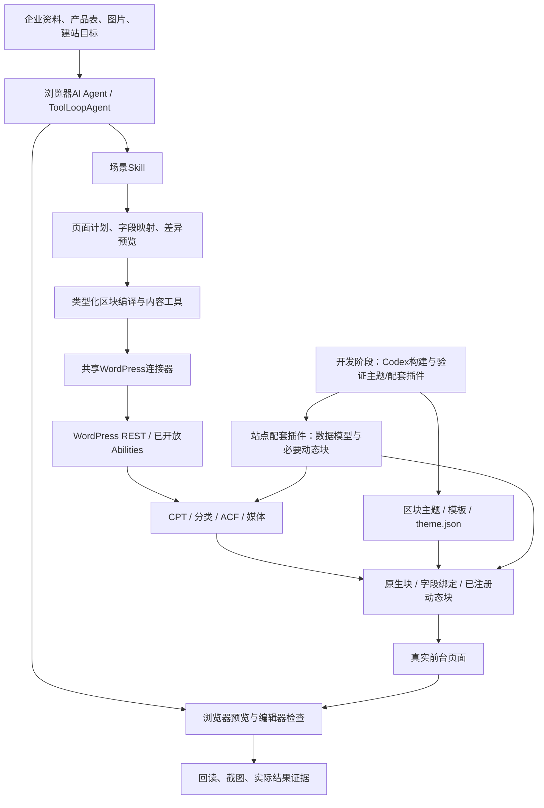

> 产品边界修正（2026-09-08）：浏览器扩展不捆绑WordPress主题，不绑定自有主题；连接器与Skill应适配用户现有主题和站点能力。原生区块/ACF/CPT是能力架构，不意味着附送固定主题。下文自有主题发行的旧方案已撤回，主题实验仅留档。

# WordPress 原生区块 AI 建站完整架构方案

版本：v1.0 · 日期：2026-09-08 · 状态：用户已确认技术路线，完整能力分阶段实施。

目标产品：章鱼外贸 AI 工具箱（浏览器 AI Agent）。

本文是本方向的统一方案入口，整合此前Gutenberg、WordPress连接器和ACF研究。文中的“规划”不代表功能已经上线；实现状态见第十一节。旧研究作为来源与决策过程保留。

## 一、最终采用的方案

采用 **WordPress 原生区块 + ACF 业务字段 + 自定义内容类型（CPT）+ 区块主题 + 共享 WordPress 连接器 + 场景 Skill**。

AI负责结构设计、代码与内容生成、数据填充和检查；WordPress负责内容持久化与渲染；运营人员可以在原生编辑器和字段表单中继续维护。

| 组成 | 解决的问题 | 外贸网站示例 |
| --- | --- | --- |
| 原生区块（Blocks） | 内容组件和页面布局 | 标题、图片、按钮、分栏、表格、FAQ |
| 区块组合（Patterns） | 复用多个区块形成的页面片段 | 首屏、优势卡片、应用案例、询盘区域 |
| 自定义内容类型（CPT） | 把业务对象组织成独立CMS内容 | 产品、案例 |
| 分类法（Taxonomies） | 对业务内容分类与检索 | 产品分类、应用行业 |
| ACF 字段 | 管理结构化业务数据 | 型号、材质、MOQ、交期、产品手册 |
| 字段绑定或动态区块 | 把数据真正显示到页面 | 根据当前产品输出规格和下载链接 |
| 区块主题（Block Theme） | 整站样式、模板与公共区域 | 产品详情模板、产品列表、页眉、页脚 |
| WordPress 连接器 | 认证、读取能力、写入与回读 | 上传图片、保存草稿、维护字段 |
| Skill | 按业务场景组织Agent流程 | 建产品页、导入产品、改版页面、生成文章 |

### 自定义页面类型是否必须加区块主题？

**技术上不必须；我们的新站完整建站方案选择加上。** CPT负责“管理哪类内容”，主题负责“怎样呈现内容”。注册产品CPT不依赖区块主题，经典主题也能显示产品；区块主题让整站模板和公共区域也能通过原生区块机制维护。[官方CPT说明](https://developer.wordpress.org/plugins/post-types/registering-custom-post-types/)、[区块主题说明](https://wordpress.org/documentation/article/block-themes/)

新建外贸站以区块主题为推荐基线；连接已有网站时先识别主题和编辑器能力，不因接入我们的工具而自动更换主题。仅新增普通页面可以继续使用现有兼容主题。

## 二、明确“页面、内容类型、模板”的区别

| 用户想做的事 | 应采用的结构 | 是否需要新增CPT |
| --- | --- | --- |
| 关于我们、联系我们、FAQ页面 | WordPress内置Page + 原生区块 | 否 |
| 一个广告落地页 | Page + 区块组合；需要时选自定义页面模板 | 通常不需要 |
| 多个产品，由运营持续上新 | 产品CPT + ACF + 单产品模板 + 分类/列表模板 | 是，或复用现有合适CPT |
| 多个客户案例 | 案例CPT + 案例字段 + 案例模板 | 适合 |
| 产品页想换另一种布局 | 当前内容类型的模板/区块布局 | 不因布局不同就新建类型 |
| 全站统一页眉页脚 | 区块主题的Template Parts | 否 |

CPT在WordPress中称Custom Post Type，中文用“自定义内容类型”更清楚；它不只指博客文章。“自定义页面模板”则控制布局，两者不能混用。

## 三、整体架构与职责



### 两个执行环境

1. **开发阶段**：Codex等代码Agent在开发环境构建主题、数据模型、必要的自定义区块，运行构建和兼容性验证，形成有版本的安装包。
2. **日常使用阶段**：浏览器Agent加载Skill，通过连接器填充内容、创建页面、修改字段、选择已有模板和检查效果。用户无需在浏览器中运行Node、PHP或WP-CLI。

不能把“Codex能修改项目文件”直接当成“浏览器连接器能任意部署站点代码”。新主题、自定义块、字段组注册需要实际部署路径；常规内容REST接口不会自动安装这些定义。

## 四、WordPress站点侧的组成

### 4.1 区块主题：只负责呈现

新站采用我们维护并测试的轻量区块主题，主要包含：

```text
主题目录/
  style.css
  theme.json
  templates/
    index.html
    page.html
    single.html
    single-oct_product.html
    archive-oct_product.html
    single-oct_case.html
    archive-oct_case.html
  parts/
    header.html
    footer.html
  patterns/
    hero.php
    benefits.php
    applications.php
    inquiry.php
  assets/
    css/
```

上面是拟定结构，CPT名称仅是新站默认示例，已有站点使用其真实注册名称。WordPress区块主题以区块模板和样式配置组成；模板按官方层级匹配内容。[主题结构](https://developer.wordpress.org/themes/core-concepts/theme-structure/)、[模板层级](https://developer.wordpress.org/themes/templates/template-hierarchy/)

职责包括：品牌色、字号、间距、内容宽度、原生块样式；详情与列表模板；公共导航、页眉页脚；必要的编辑器与前台一致样式。布局断点和特殊样式由真实部署的资产负责，不能靠浏览器临时注入CSS充当发布。

用户在Site Editor保存的模板/样式可能覆盖主题文件。Agent读取、改版和升级时必须区分主题默认版本与用户数据库覆盖，避免主题升级后误报修改已生效。

### 4.2 数据模型与必要组件：放在站点插件层

CPT、分类法、ACF字段定义及业务动态块由站点配套插件统一注册，保持与主题解耦。WordPress官方也建议CPT放在插件中，以便更换主题时内容模型仍可使用。[官方建议](https://developer.wordpress.org/plugins/post-types/registering-custom-post-types/)

新站使用版本化定义作为数据模型来源；已有站点优先读取并复用现有ACF/CPT配置。不让ACF界面定义、代码注册和另一插件同时注册同名类型或字段。

站点配套插件是业务数据和组件载体，不是另一套页面编辑器。最低范围包括：

- 产品和案例CPT、对应分类法；合适的编辑器、标题、特色图等支持。
- ACF字段组和稳定字段标识，按需要开放REST读取/写入。
- 复杂规格表等必要的动态块及字段输出。
- 若原生API不足，提供有schema、权限检查和版本号的限定能力；不提供任意PHP执行接口。

部署与初始化是独立步骤：先生成安装包及变更计划，在测试站验证，再通过已授权站点管理流程安装/激活。现有连接器尚无此完整部署能力，不能只凭应用密码宣称已创建主题和自定义组件。

## 五、CMS内容与ACF字段设计

### 5.1 内容结构

| 对象 | 推荐管理方式 | 原生内容与字段分工 |
| --- | --- | --- |
| 产品 | 产品CPT | 标题、描述、特色图用原生能力；技术和采购数据用ACF |
| 案例 | 案例CPT | 正文用原生块；行业、应用产品、项目背景等用字段/关联 |
| 博客 | 内置Post | 分类、正文、图片使用原生功能，按需要补字段 |
| 企业常规页面 | 内置Page | 原生块与Pattern组合 |
| 产品分类、应用行业 | 分类法 | 便于列表、筛选和关联，避免只保存成自由文本 |

### 5.2 产品字段示例

| 信息 | 存储位置 | 建议值类型 | 前台使用 |
| --- | --- | --- | --- |
| 产品名称 | 原生title | 文本 | 标题/列表卡片 |
| 介绍 | 原生content | 原生区块 | 详情正文 |
| 主图 | 原生featured_media | 媒体ID | 首屏/列表卡片 |
| 型号 model | ACF产品字段 | 文本 | 参数/型号展示 |
| 材质 material | ACF产品字段 | 文本或预定义选项 | 参数表 |
| 最小起订量 moq_value / moq_unit | ACF产品字段 | 数值 + 单位 | 采购信息 |
| 交期 lead_time | ACF产品字段 | 文本 | 采购信息 |
| 产品手册 datasheet | ACF产品字段 | 文件/媒体引用 | PDF下载 |
| 规格 specifications | ACF字段组 | 固定字段；复杂情况为重复字段 | 动态规格表 |
| 关联案例 | ACF关系字段或明确关联模型 | 内容ID | 案例推荐 |

字段表是新站起点，不应不加判断地套用所有企业。重复字段等能力按实际ACF版本/许可决定；不将PRO能力写成免费版保证。空值、单位、枚举与媒体引用在导入前校验。

### 5.3 数据只能有一个维护来源

同一产品参数以ACF产品字段为来源，页面通过绑定或动态渲染读取，不把它复制成多个静态段落后声称会同步更新。

局部宣传文案可保存在页面区块；全站重复的品牌信息可使用站点设置或明确的全局字段。块级ACF字段与产品级post meta分别管理，不能混用现有CPT字段接口写任意ACF Block实例。

ACF REST需字段组主动开放；CPT也需开放REST，原生区块编辑能力还取决于对应editor支持和站点配置。[ACF REST](https://www.advancedcustomfields.com/resources/wp-rest-api-integration/)、[CPT REST支持](https://developer.wordpress.org/rest-api/extending-the-rest-api/adding-rest-api-support-for-custom-content-types/)

## 六、原生区块与字段怎样组成可编辑页面

分三层选用，按实际需要升级：

| 层级 | 使用方式 | 使用条件 |
| --- | --- | --- |
| 原生内容块 | 标题、段落、图片、按钮、分栏、表格等 | 内容直接编辑，序列化符合该版本WordPress规范 |
| 原生块 + Block Bindings | 把受支持的块属性绑定到ACF字段 | 检测字段访问设置、绑定来源、块属性与数据类型支持 |
| 自定义动态块 / ACF Blocks | 产品规格、复杂重复内容等专用组件 | 站点已部署注册/渲染代码；ACF Blocks需要ACF PRO |

ACF提供acf/field绑定来源，但支持范围受字段类型、块属性和权限限制，不是所有字段任意绑定。复杂字段需动态块或专门渲染。[ACF绑定](https://www.advancedcustomfields.com/resources/block-bindings/)、[ACF Blocks](https://www.advancedcustomfields.com/resources/blocks/)

“全部可编辑”的交付定义是：需求中需要运营维护的文字、图片、产品信息与组件选项，都有明确编辑入口。布局可在开放范围内调整；复杂行为或没有暴露的参数仍属于代码维护范围。整页HTML塞入Custom HTML块不满足这个目标。

首批Pattern：图文首屏、优势卡片、产品规格区域、应用/案例、FAQ、询盘CTA。默认展开为独立块；只有用户需要联动维护时才创建同步Pattern。

## 七、浏览器Agent、Skill与连接器设计

### 7.1 一个共享WordPress连接器

统一入口：设置 → 连接器 → WordPress。配置站点HTTPS地址、用户名与应用密码，一次配置供全部WordPress Skill复用。凭据只由连接器读取，不写入Skill、页面计划或公开仓库。

连接器负责：

- 核对真实REST根路径、站点身份与配置变化；只向验证过的站点发送凭据。
- 读取内容类型、字段schema、已注册区块、主题、模板及可访问的设计设置；权限不足标为未知。
- 页面/文章/媒体/产品字段的实际写入，保留服务器返回ID、状态与回读证据。
- 对写入进行现有产品确认、冲突检查、操作记录与失败恢复；未知结果不重复创建。
- 后续接入限定的站点初始化/组件能力时，仍复用这一个连接器。

基础内容操作使用WordPress REST API即可；MCP不是基础建页的必要依赖。WordPress Abilities可作为扩展能力契约，是否开放以站点实测为准。[REST认证](https://developer.wordpress.org/rest-api/using-the-rest-api/authentication/)

### 7.2 场景Skill

| Skill | 目标 | 规划方式 |
| --- | --- | --- |
| WordPress页面设计与生成 | 根据企业资料建页或调整已有页面 | 升级现有wordpress-block-pages，保持内部名称与旧版本兼容 |
| 产品内容管理 | 识别已有CPT/字段，录入、导入和核验产品 | 在已有wordpress-acf-products基础上扩展 |
| 图文素材与发布 | 上传图片/PDF、插入正文和特色图 | 复用wordpress-media |
| 询盘表单 | 创建/嵌入已支持的表单并检查效果 | 复用wordpress-forms，保留WPForms实际能力边界 |
| 站点模板与样式 | 维护全站主题样式、公共区域和模板 | 后续独立Skill，区别于普通页面修改 |
| 站点初始化 | 识别环境、准备主题/数据模型安装与初始化计划 | 后续能力；只有部署工具存在后才启用执行模式 |

Skill写业务流程与决策，详细字段、样式、页面配方和验证要求放references；Pattern等素材放assets。确定性序列化、数据校验和API调用写在产品工具中，不让模型每次临时发明实现。

### 7.3 底层工具规划

- 设计信息读取：主题、实际模板、有效设计预设、区块支持范围与来源记录。
- 页面编译：受控且有界的嵌套区块树、样式值和Pattern变量，输出固定版本计划/区块文件。
- 内容保存：复用现有wpWriteContent，补模板选择和编译成果引用。
- 局部修改：按原始区块定位修改目标，保留未修改/未知块；对比修改时间及内容哈希，不能用简化schema重建整个现有页面。
- 字段读写：依据站点实际schema处理文本、数值、媒体和关系，批量操作先预览再逐批保存。
- 预览验收：复用已有浏览器工具，检查真实主题下的页面与编辑器。

## 八、完整使用流程

### A. 新建网站

企业资料与市场定位 → 规划内容模型/导航/页面 → 确定品牌样式 → 准备区块主题、CPT与ACF定义 → 构建安装包并在测试站验证 → 完成站点部署 → 连接器检测实际能力 → 创建内容与素材 → 模板/字段绑定 → 预览、修正与发布。

主题和数据模型的部署是新站必要阶段；后续日常建页无需重复安装。

### B. 给已有网站新增产品

连接站点 → 读取真实产品CPT/ACF定义 → 上传媒体 → 核对字段映射 → 创建产品草稿 → 模板读取产品字段 → 浏览器核验 → 发布或交付草稿。

如果站点只有字段、没有前台字段输出模板，应报告这一缺口并生成适配计划，不能把“保存ACF成功”当成“产品页面完成”。

### C. 生成广告落地页

读取企业事实与已有主题设计 → 生成Page布局 → 选择站点真实存在的页面模板 → 组合原生块与素材 → 保存草稿 → 检查手机布局、CTA与表单 → 按目标状态交付。

### D. 后续维护

运营在后台修改型号、MOQ、图片 → 绑定字段或动态块显示新数据；AI也可通过连接器批量修改。同步内容需核对缓存与真实前台，不只检查数据库响应。

## 九、代码、数据、版本与交付

职责分离为四类包：浏览器扩展工具代码、Skill内容包、WordPress区块主题包、站点业务插件包。ACF作为实际站点依赖，是否PRO按功能要求声明，不捆绑无法再分发的商业代码。

主题与业务插件版本化维护；页面和产品是站点数据，不打包进通用Skill。上游代码/Skill只在许可证允许范围内复用并保留归属。后续公开仓库采用独立发布目录或独立仓库，不公开当前私有产品仓库和企业资料。

版本兼容以测试矩阵记录核心、ACF、主题/业务插件和区块编译器版本。生产版本使用已验证组合，不能把最新版区块说明当所有用户站点都支持。

升级时保留字段标识、已存数据与原始页面；迁移模型需明确映射和回滚方案。未知块不删除，主题切换不删除产品数据。读取成功、写入成功、视觉正确、用户可再编辑分别留证。

## 十、实施阶段与完成标准

| 阶段 | 工作范围 | 完成标准 |
| --- | --- | --- |
| 1 页面布局与样式 | 设计档案、嵌套布局、受控样式、模板选择、六类Pattern、Skill升级 | 能生成符合现有主题的页面草稿；保存重开无无效块，手机与桌面可用 |
| 2 字段驱动CMS | 产品/案例模型规范、ACF字段、绑定和必要动态块、字段维护工具 | 改一个产品字段能在对应模板显示；批导数据与显示一致 |
| 3 新站交付 | 区块主题、业务插件、初始化、安装包与验证站点 | 从新WordPress安装到产品/案例/博客页面形成可重复流程 |
| 4 维护与改版 | 局部区块更新、全站样式/模板工作流、兼容迁移 | 保留人工修改与未知组件，变更可追溯，可恢复 |

必须验收的业务结果：

- AI创建后，用户能在原生编辑器修改文字、替换图片并重新保存。
- ACF字段修改后，实际前台引用数据更新；没有仅复制成静态文本。
- 分类、列表、详情模板按正确内容类型运行，空字段无乱码或错误占位。
- 主题/用户全局设置覆盖被正确识别；传统主题接入不会自动换主题。
- 真实草稿预览、窄屏、长文案、表单及下载链接检查通过。
- 写入被拒绝无外部请求；超时不重复建页；并发修改会提示冲突。
- 模拟API测试、官方块解析验证与真实站点端到端验收分别记录。

## 十一、当前项目状态与下一步

核对工作区：codex/agent-workspace-sandbox，HEAD 953ba652；实际WordPress增量仍有未提交文件。提交号不代表所有工作区内容已冻结。

| 项目 | 当前状态 |
| --- | --- |
| 共享WordPress配置、基础读写、媒体上传 | 已接入上一阶段源码 |
| 基础原生块页面与已有ACF产品草稿导入 | 已实现有限范围，已有定向测试记录 |
| WordPress相关5个Skill及前端入口 | 已接入 |
| 布局与样式、主题设计档案、模板选择 | 0908工作区实现并通过定向回归；主题读取不含用户样式覆盖，真实站点验收待完成 |
| ACF动态字段绑定、完整内容模型初始化 | 固定产品/案例模型及原生meta绑定已实现；复杂模型待扩展 |
| 自有区块主题、业务插件、自定义块部署 | 自有主题/插件ZIP已交付；使用原生块，不包含任意自定义代码部署 |
| 新站完整交付与真实站点验收 | 待实施/待实际站点配置 |

方案定稿后已继续完成阶段1的有限页面布局实现，见WordPress模块文档。固定字段CMS与主题/插件ZIP首版已完成；真实客户站点从资料到上线的端到端验收和复杂扩展仍待完成。

此前资料：[页面Agent研究](research/gutenberg-page-agent-20260908/方案.md)、[WordPress现有模块与验证范围](modules/wordpress-workflows.md)。后续状态以源码与对应阶段验收记录更新，不以聊天中的“完成”替代。
