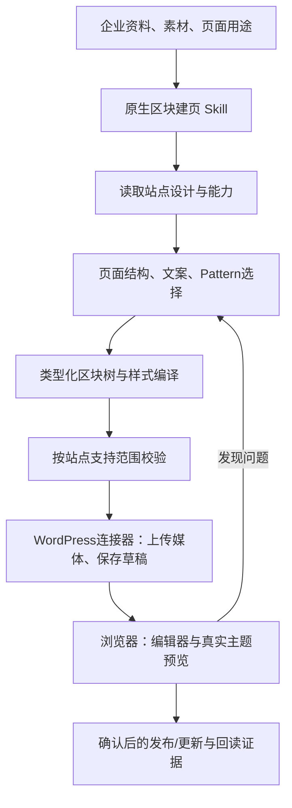

# Gutenberg 页面设计 Agent：Skill、区块引擎与 WordPress 连接器方案

研究日期：2026-09-08（Asia/Shanghai）。源码核对：主工作区 codex/agent-workspace-sandbox，HEAD 057d493；含前一轮未提交的WordPress增量。本文件是下一阶段设计方案，不表示新增样式能力已实施。

## 1. 结论与术语

建议升级现有 wordpress-block-pages，提供“根据企业资料生成符合当前主题的原生区块页面”。复用WordPress连接器，并增加站点设计信息探测、布局与样式编译、Pattern组合、页面局部更新和真实预览验收。

- WordPress Block Editor是原生内容编辑器，常称Gutenberg；使用核心自带编辑器不要求额外安装Gutenberg开发插件。[官方说明](https://wordpress.org/documentation/article/wordpress-block-editor/)
- Site Editor用于编辑站点模板、页眉页脚和全局样式，需要区块主题；能使用页面区块编辑器并不代表站点具备完整站点编辑能力。[Site Editor](https://wordpress.org/documentation/article/site-editor/)
- Block是内容组件，Pattern是多个区块的可复用组合，Template决定页面外层结构，theme.json/Global Styles负责主题设计设置。这些应成为产品对外术语；内部的页面计划文件只用于执行。[Patterns](https://developer.wordpress.org/block-editor/reference-guides/block-api/block-patterns/)、[Global Styles](https://developer.wordpress.org/block-editor/how-to-guides/themes/global-settings-and-styles/)

## 2. 当前实现与差距

实际读了wordpress.ts、wordpress-workflows.ts、wordpress-blocks.ts、wordpress-block-pages.md及模块文档；此前119项测试和基础块有效性记录属于上一阶段，不作为本方案新能力的验证。

| 能力 | 当前源码 | 本次需要补齐 |
| --- | --- | --- |
| 站点连接 | 单站HTTPS、用户名、应用密码；固定站点API、连接测试 | 站点资料与权限探测；支持实际REST根路径发现，处理子目录/不同安装URL；不得把凭据转发到任意发现的域名 |
| 能力探测 | 内容类型、插件Abilities第一页 | 主题、核心版本可用证据、已注册区块及supports、实际模板、颜色/字体/间距预设 |
| 页面生成 | 标题、段落、图片、按钮、浅层group、表单shortcode | columns/column、cover、media-text、list、table、details等；按版本和站点能力筛选 |
| 视觉设计 | 固定类名，主要依赖主题默认样式 | 容器宽度、对齐、背景、间距、字体层级、边框、圆角；有界嵌套与受控style属性 |
| 主题适配 | 没有主题设计档案；写工具没有template字段 | 读取有效设计设置，选择站点真实存在的页面模板；正文H1与模板标题避免重复 |
| 修改页面 | 按modified_gmt检查后整体写入 | 按原始区块树定位目标分区；保留未修改/未知区块，预览差异后保存 |
| 验收 | 接口回读，Skill要求浏览器检查 | 完整的草稿预览与编辑器二次保存验证、桌面/手机布局报告 |

当前“可以生成基础原生块页面”的结论成立；“能做任意品牌化页面样式”尚未实现。

## 3. 在现有 Agent 内如何运行



沿用ToolLoopAgent、文件版本、写入确认与回执；不新增另一套聊天Agent。Skill指导任务，受测的TypeScript工具执行序列化与请求；凭据由连接器管理。无需用户安装Codex、Node或WP-CLI。

具体例子：用户要求英文工业泵产品页 → 读取企业规格和已有站点 → 选择首屏图文、优势、多列应用、参数表、FAQ、询盘CTA → 上传照片 → 生成原生区块树与主题预设样式 → 先保存草稿 → 真实主题下检查手机堆叠/按钮/表单 → 按用户指定状态交付。SEO词来自已有DataForSEO工作流，不能替代企业事实。

## 4. 布局和样式怎样做

### 4.1 原生核心区块与 Pattern

首批扩展core/group、columns/column、cover、media-text、list/list-item、table、details，并升级已有heading、paragraph、image、buttons。不因为最新版文档出现某个新块，就假设所有用户站点可用。[区块类型API](https://developer.wordpress.org/rest-api/reference/block-types/)

自有B2B Pattern库建议从六类开始：图文首屏、优势卡片、产品规格、应用/案例、FAQ、询盘CTA。Pattern中只存受支持的核心区块结构和变量，绑定真实文案/媒体后展开为独立区块。默认不创建全站同步Pattern，避免一个页面修改联动多个页面；保存到站点Pattern库作为后续明确功能。

### 4.2 设计设置来源

优先读取主题提供的颜色、字体和间距预设及内容宽度，叠加可读取的用户自定义Global Styles，再用浏览器实际页面样式核对。主题文件、用户全局设置、插件CSS和页面样式可能同时生效；一个接口响应不能代表最终视觉效果。

原生Block Supports允许部分区块声明颜色、排版、间距等支持，实际写入需同时满足区块、主题和版本约束。[Block Supports](https://developer.wordpress.org/block-editor/reference-guides/block-api/block-supports/)

不要给所有区块都生成任意style对象，也不要发明通用mobile/tablet属性。优先使用原生Columns堆叠、布局与流式排版。主题不支持的样式采取等价布局或明确回报未支持。

### 4.3 原生样式不足时

第一阶段使用主题预设和受控区块属性，不默认修改全站Global Styles。额外CSS确有必要时，可在后续提供轻量站点配套插件，注册页面范围内样式且同时加载到前台/编辑器；该插件只实现限定接口，不开放任意PHP或文件写入。它不属于第三方页面编辑器。

浏览器临时注入CSS只能用于预览，不能报告为已发布样式。任意动效、自定义断点或交互需要明确的已部署资产能力。

## 5. 连接器规划

继续使用“设置 → 连接器 → WordPress”。第一阶段保持一个站点配置，Skill不重复存密码。应用密码继承对应WordPress用户权限，本身不是细分权限scope；由站点选择适当用户角色。[认证说明](https://developer.wordpress.org/rest-api/using-the-rest-api/authentication/)

| 连接器能力 | 官方接口或机制 | 产品适配要求 |
| --- | --- | --- |
| 身份/连接 | REST根信息、users/me，实际权限检查 | 测试通过仅表示相应读取成功，不能直接标全部可写 |
| 页面与媒体 | wp/v2/pages、wp/v2/media | 复用现有创建/回读/媒体工具；补页面template参数的真实枚举校验 |
| 可用区块 | wp/v2/block-types | 按分页/命名空间读取，保留版本和supports；服务端注册列表不等于某个编辑器上下文全部可插入 |
| 主题信息 | wp/v2/themes | 按授权读取活动主题；权限不足标未知，不能推断为不支持 |
| 设计设置 | Global Styles控制器的主题与用户记录路由 | 先检测路由和权限，区分读取与全站修改；不能视为写theme.json文件 |
| 页面模板 | 页面OPTIONS schema和可访问模板接口 | 仅选站点实际存在模板；没有全宽模板就报告主题限制 |
| 预览与修订 | 草稿预览、pages修订和现有读回机制 | API应用密码不会自动建立浏览器登录态；由已登录浏览器预览，输出真实检查范围 |

参考：[Pages](https://developer.wordpress.org/rest-api/reference/pages/)、[Themes](https://developer.wordpress.org/rest-api/reference/themes/)、[Global Styles控制器](https://developer.wordpress.org/reference/classes/wp_rest_global_styles_controller/)。Global Styles REST手册直链本次读取失败，使用官方控制器文档核对；具体路由实现阶段再按目标站点探测。

基础页面/媒体不需要MCP或站点配套插件。将来需要站点额外能力，可通过WordPress Abilities暴露并仍复用同一连接器，不为每个Skill增设API配置。

## 6. Skill 如何组织

升级现有wordpress-block-pages，用户可见名可改为“WordPress 页面设计与生成”，保持内部name和历史版本迁移。创建与局部改版先作为一个Skill的两种模式；全站设计样式后续独立Skill，以免普通建页触发全站修改。媒体、询盘表单继续复用已有技能/工具。

建议包内容：

```text
wordpress-block-pages/
  SKILL.md                 触发条件、输入、流程、结果要求
  skill.json               website分类、wordpress连接器依赖
  references/
    site-profile.md        主题/版本/权限读取和降级规则
    layout-and-styles.md   区块支持、样式预设、响应式约束
    page-recipes.md        产品、案例、FAQ、广告落地页模式
    verification.md        编辑器/真实预览/回读验收
  assets/patterns/          受测的原生区块组合
  LICENSE.txt
```

SKILL工作流：读取资料与站点 → 规划 → 选择Pattern并生成结构 → 编译校验 → 保存草稿 → 实际预览修改 → 按授权发布。保留输入/结果文件版本及页面ID。改版先读取原始块，未知块不擅自重建；用户修改导致冲突时重新比对目标区块。

Skill正文只写已存在的工具；下面工具为拟新增，实施前不得写入当前可用工具清单：

| 建议工具/模块 | 职责 | 与当前代码关系 |
| --- | --- | --- |
| wpReadDesignProfile | 只读主题、样式预设、模板、区块能力 | 扩展现有discoverWordpress；返回证据和未知项 |
| wpCompilePage | 有界区块树、样式、Pattern变量校验与序列化；产出固定版本内容文件 | 扩展wordpress-blocks.ts，序列化集中受测 |
| wpWriteContent | 读取已校验页面计划或旧blocks输入保存；增加template | 保留现有旧入参兼容，不能让旧会话失效 |
| wpPatchPageBlocks | 版本校验、目标块修改、保留其他原始内容与差异 | 后续新增；不是用简化schema重建整页 |
| 既有浏览器工具 | 读取实际预览与编辑器提示 | 复用BrowserDriver，不再发明连接器浏览器 |

## 7. 开源 Skill 取舍

已读WordPress官方仓库及以下三个SKILL.md；它们明确面向能访问文件系统、bash/Node、部分WP-CLI的开发Agent，需要改写运行方式。[官方仓库](https://github.com/WordPress/agent-skills)

| 上游 | 吸收内容 | 浏览器适配 |
| --- | --- | --- |
| [wp-block-themes](https://github.com/WordPress/agent-skills/tree/trunk/skills/wp-block-themes) | 主题样式来源、模板/Pattern与覆盖问题 | 目录扫描改为API与浏览器；theme.json修改改为读取设计设置，全站写入另设能力 |
| [wp-block-development](https://github.com/WordPress/agent-skills/tree/trunk/skills/wp-block-development) | 块属性、序列化、保存有效性、嵌套 | 用于编译器和验证规则；不把create-block/npm构建交给产品用户 |
| [wp-rest-api](https://github.com/WordPress/agent-skills/tree/trunk/skills/wp-rest-api) | 鉴权、输入schema、权限与错误 | 落在连接器工具代码；Skill只保留操作决策 |

对原文复制/改编必须核对并保留上游许可证与归属；本次只研究，没有安装或复制成产品Skill。[上游许可证](https://raw.githubusercontent.com/WordPress/agent-skills/trunk/LICENSE)

## 8. 实施顺序与验收门槛

1. 设计档案与布局引擎：只读能力探测、嵌套区块、样式支持、template字段、六类Pattern、旧输入兼容。
2. 新页面完整闭环：升级Skill，生成产品/案例/FAQ/落地页草稿；在实际站点主题下验收。
3. 局部改版：原始块保留、版本/内容哈希、差异预览和冲突处理。
4. 可选全站样式：区块主题专用；Global Styles、模板部分及配套样式插件另设范围。

验收案例至少包括：区块主题与经典主题；权限不足；没有全宽模板；存在用户Global Styles覆盖；未知区块保留；图片缺失；内容含特殊字符；长中文/英文；手机横向溢出；保存后重新进入编辑器无无效块；用户随后修改一个标题再保存仍有效；网络丢失不重复建页。

发布回执、原生块有效性、真实主题视觉呈现、表单送达分别验收。第一阶段成功标准是“用户可在原生编辑器继续修改的、符合现有站点风格的页面”，不要求自动重写主题或安装页面编辑器。

## 9. 字段驱动与区块主题补充（0908用户澄清）

区块主题是使用区块模板构建整站结构的主题；普通区块页面也可运行于支持区块编辑器的经典主题。不能把使用区块与必须换区块主题等同。

用户强调CMS字段管理与可二次编辑，需要区分：普通内容通过核心区块编辑；产品型号/材质等作为产品CPT的ACF字段；页面或模板通过Block Bindings引用已支持字段；重复规格组或复杂组件必要时使用站点已注册ACF Blocks。ACF Blocks属于ACF PRO，要求站点部署block.json/渲染代码；它的块级字段与产品post meta不是同一个存储概念，不能把现有产品REST导入当成任意ACF块字段写入。

正式执行原则：同一业务值确定一个数据来源，避免把字段值复制成静态正文而声称动态绑定。可编辑性取决于已定义区块属性/字段、注册的渲染实现、绑定支持和权限。不能保证任意AI生成的HTML/PHP代码都能在可视化编辑器逐项修改。

当前浏览器连接器可创建基础块页面和已有CPT的ACF产品草稿；未实现任意字段组/自定义块/主题部署，也未实现ACF字段到核心块的动态绑定。先完成已有方案的核心布局与样式；字段绑定作为明确扩展，复杂新组件部署需独立站点能力。

关于Codex主流方案：WordPress官方agent-skills提供wp-block-themes、wp-block-development等，支持它是官方支持的成熟技术路径；本次没有取得Codex建站方式的可靠使用占比，不能据此称多数用户或唯一主流。

来源：[Block themes](https://wordpress.org/documentation/article/block-themes/)、[ACF Block Bindings](https://www.advancedcustomfields.com/resources/block-bindings/)、[ACF Blocks](https://www.advancedcustomfields.com/resources/blocks/)、[ACF REST](https://www.advancedcustomfields.com/resources/wp-rest-api-integration/)、[官方Agent Skills](https://github.com/WordPress/agent-skills)。

## 完整架构统一入口

用户确认原生区块、ACF与内容类型方案后，已整合为[WordPress原生区块AI建站完整架构方案](../../WordPress原生区块AI建站完整架构方案.md)。本文保留早期页面研究；整站数据模型与区块主题分工以统一方案为准，实施状态仍按实际源码核对。
