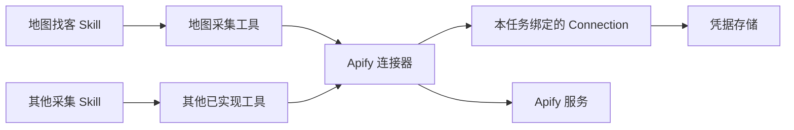

# AI Agent 连接器配置架构对标研究

研究日期：2026-09-07（Asia/Shanghai）。范围：主流产品官方文档中的术语、配置入口、授权对象及复用关系。面向本项目外贸业务员和运营用户。

本轮只研究与记录，不修改产品代码。以下为官方文档核验，不是各产品登录后的逐屏实测；菜单可能因版本、套餐和组织权限不同而变化。搜索摘要出现旧名称时，以本次打开的官方正文为准。n8n 的凭据文档请求失败，未将其具体页面路径纳入已核验结论。

## 1. 结论

没有统一的菜单名称，但存在可复用的职责划分：工作方法、外部服务适配、已授权账户、可调用工具、分发包分别管理。API Key 是认证字段；环境变量是配置传递机制；两者都不适合作为面向外贸用户的整个功能模块名称。

建议本项目采用「技能 Skills」和「连接器 Connectors」两个并列入口，保留现有「模型连接」。连接器详情内管理「已连接账户」和「授权配置」。底层明确区分 Connector 定义与 Connection 实例。此方案是基于对标的本项目建议，不是宣称所有厂商使用同一架构。

## 2. 厂商证据

| 产品 | 官方称呼与入口 | 配置与复用关系 | 对本项目的启发 |
|---|---|---|---|
| Claude | Customize 下分 Skills、Connectors、Plugins；统一目录负责发现和安装 | Skills 提供知识与工作流；Connectors 管理外部服务认证与工具权限 | 最接近我们的场景技能产品，采用技能与连接器并列 |
| ChatGPT / Codex | 官方当前文档区分 Apps 与 Plugins；通过 Plugins Directory 发现，Settings > Apps 管理个人应用连接 | App 连接外部服务；Plugin 可包含 Apps、Skills 和模板；安装包不替代应用授权 | 借鉴分发与授权分离，不把所有对象都叫 Skill |
| Microsoft Copilot Studio | Tools 添加 Connector 工具；Agent Settings > Connection Settings 管理连接 | Connector 封装服务操作；Connection 绑定认证，页面展示使用该连接的工具/知识源及状态 | 借鉴 Connector 与 Connection 分离，以及依赖可见性 |
| Dify | 当前云端文档使用 Integrations，下分 Model Providers、Tools 等；工具管理为 Integrations > Tools | 工具可来自插件、OpenAPI、工作流、MCP；工具插件凭据支持工作区配置 | 借鉴模型与外部工具分类，以及统一凭据复用 |

来源：

- Claude [统一目录](https://support.claude.com/en/articles/14328846-browse-skills-connectors-and-plugins-in-one-directory)、[Skills](https://support.claude.com/en/articles/12512180-use-skills-in-claude)、[Connectors](https://support.claude.com/en/articles/11176164-use-connectors-to-extend-claude-s-capabilities)。
- OpenAI [Apps in ChatGPT](https://help.openai.com/en/articles/11487775-connectors-in)。当前正文已提到 Plugins Directory；不要仅按旧搜索摘要中的 App Directory 设计。
- Microsoft [Connector 工具](https://learn.microsoft.com/en-us/microsoft-copilot-studio/advanced-connectors)、[Connection Settings](https://learn.microsoft.com/en-us/microsoft-copilot-studio/authoring-connections)。
- Dify [Integrations](https://docs.dify.ai/en/cloud/use-dify/workspace/plugins)、[Tools](https://docs.dify.ai/en/cloud/use-dify/workspace/tools)、[Tool Provider 开发模型](https://docs.dify.ai/en/develop-plugin/dev-guides-and-walkthroughs/tool-plugin)。旧开发文档仍使用 Plugin，不应当作当前云端导航的完整描述。

## 3. 本项目术语约定（建议）

| 对象 | 含义 | 示例 | 用户是否直接管理 |
|---|---|---|---|
| Skill / 技能 | 专业方法和任务流程，可包含参考资料 | 地图找客、客户背调、On-page SEO | 是：选择、启停、查看依赖 |
| Connector / 连接器 | 受支持外部服务的适配定义，包含认证方式和可提供工具 | Apify、未来的 Gmail | 是：查看服务与能力、连接账户 |
| Connection / 连接 | 某个用户或工作区实际配置的服务账户实例 | 我的 Apify、公司 Apify | 是：在连接器详情中管理 |
| Credential / 凭据 | 连接使用的密钥或授权材料 | API Token、OAuth Token | 只通过授权表单输入或更新 |
| Tool / 工具 | Agent 实际调用的操作 | 启动采集、读取数据集 | 主要展示能力与权限，无需单独顶级管理页 |
| Plugin / 插件包 | 可分发的功能组合 | 外贸获客套件：多个 Skill 与连接器声明 | 后续确有包分发需求再建立入口 |
| MCP | 连接工具和资源的协议方式 | 远程 MCP 服务 | 放高级添加入口，不要求普通用户先理解 |
| API Key | 某一种认证字段 | Apify Token | 不作为总菜单名称 |
| 环境变量 | 运行配置的传递方式 | 服务运行时的变量绑定 | 不直接向模型开放全局密钥字典 |

Skill 不必全部依赖外部连接器。例如使用当前页面的 SEO 检查可以直接调用插件已有的浏览器工具。一个连接器可以提供多个工具；多个技能可以调用相同工具。

## 4. 建议的信息架构

设置中保留「模型连接」「技能」，新增「连接器」；不要再同时新增「API 管理」「服务连接」「凭据中心」三个重叠入口。

| 页面 | 主要内容 | 主要动作 |
|---|---|---|
| 设置 > 连接器 | 服务名、功能简介、连接状态；已连接/全部筛选 | 添加连接、打开详情 |
| 连接器 > Apify | 已连接账户、可用能力、关联技能、认证方式 | 连接账户、测试连接、重新连接、断开 |
| Apify > 授权配置 | 连接名称、Token 输入、官方获取入口；需要时显示高级字段 | 保存与验证 |
| 技能 > 地图找客 | 场景说明、输入输出、所需连接器及状态 | 选择技能、前往连接器配置 |
| 任务中的配置提示 | 明确缺少哪个连接，保留任务草稿与上下文 | 配置后返回任务 |

连接器列表只展示实际实现的服务；不能把规划服务渲染成可使用。配置状态与能力接入状态分开：保存 Token ≠ 验证有效 ≠ 具体工具有权限 ≠ 任务成功。

默认只要求用户创建一个连接。底层为多个账户保留 connectionId，后续需要个人/公司账号时扩展，第一版不增加复杂的团队选择页面。

## 5. 执行关系与配置边界

这是本项目拟采用的关系图，不是任何厂商私有实现的复刻。其他采集 Skill 与工具仅说明复用关系，不代表项目已实现。

- ConnectorDefinition：稳定 ID、认证方式、官方端点、配置字段、工具声明、权限说明。
- Connection：connectionId、connectorId、显示名称、状态、非敏感配置、credentialRef。第一版只有本地用户作用域，团队复用需另做权限机制。
- ToolDefinition：参数与结果类型、所需连接器、操作权限、费用属性。内置浏览器工具可以没有 connectorId。
- SkillDependency：引用连接器/工具的稳定 ID，标明必须或可选，不存 Token 或实际账户信息。
- 运行时：解析依赖 → 确定任务连接 → 检查权限和配置 → 在可信执行层读取凭据 → 调用 → 保存任务进度和结果。模型只获得工具与状态，不获得凭据。
- 多个 Skill 可以复用同一 Connection，但不是所有任务无条件共享所有账号。任务启动后绑定具体 connectionId，账户变更后重新验证，避免执行中误切账户。
- 地区、商家类型、数量是任务参数；Token、认证地址属于连接配置；产品卖点与目标客户属于业务背景。三者不要混在同一表单。
- 浏览器网页登录态和 API 授权连接分开。Chrome 已登录 Google 不代表已授权 Google Ads API。
- 停用 Skill 不等于断开账户；移除功能包不应静默删除其他技能共用的凭据；断开连接不删除已产生的客户结果。

## 6. 当前实现差距

代码核对：`src/agent/settings-navigation.ts` 当前没有连接器路由；`src/agent/skills/view.ts` 在技能列表嵌入 Apify 配置；`src/agent/skills/detail-content.ts` 也直接嵌入表单；`src/agent/skills/catalog.ts` 只允许一个 Apify 依赖；`src/agent/connections/apify.ts` 实现的是单服务凭据保存与账户验证。

现有凭据已经独立于技能包保存，可以保留迁移。问题主要是配置入口位置、服务定义写死、依赖关系不完整，不需要推翻所有已有代码。当前本地存储访问限制不等于系统级密钥保险库，不应宣传为已实现加密保险库。

地图找客 Skill 与 Actor 执行链路仍未交付。本轮不因有 Token 表单而改变这一状态。

## 7. 后续实施顺序

1. 固定命名：技能、连接器、模型连接；连接器详情中的账户与授权配置。
2. 做连接器列表、详情、技能依赖提示的页面流程，以现有组件和样式为基准。
3. 把 Apify 配置迁入连接器路由，迁移已有凭据，两个 Skill 入口改为依赖状态与跳转。
4. 建立连接解析与执行接口，再接入地图找客工具与可选择的 Skill。
5. 验收配置一次跨技能复用、缺失/失效状态、返回任务、账户更换、导出不含密钥、任务恢复不重复收费。

不在这一阶段新增团队凭据共享、完整插件市场、通用任意脚本执行或全部第三方服务接入。
